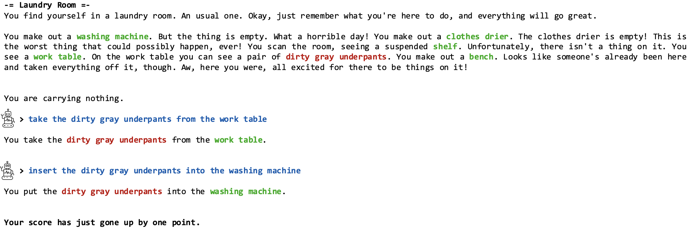

# Benchmark Datasets for Commonsense Reasoning
{: .no_toc }

Editors: [Bill Yuchen Lin](https://yuchenlin.xyz/), [Yang Qiao](https://www.linkedin.com/in/xiaoyang-qiao/), [Peifeng Wang](https://scholar.google.com/citations?user=3jfQnM4AAAAJ&hl=en), [Pei Zhou](https://sites.google.com/g.ucla.edu/peizhou/home){: target="_blank"}

{: .fs-5 .fw-300 }

We present a comprehensive collection of datasets for testing commonsense reasoning ability. They are grouped by different formulations, and covered a wide range of aspects: properties of common objects, real-life situations, elementary science, social skills, etc. 

 
## Table of contents
{: .no_toc .text-delta .fs-4 style="font-weight:800"}

- TOC
{:toc}

---

<details markdown="block">
  <summary>Summary Table</summary>
{: .fs-4 .text-delta .text-blue-200 style="font-weight:800"}
  
| Name | Link | Tags | Format |  SotA vs. Human 
| :------------:| :-----: | :-----: | :------: | :---------: | :-------: | :-----------: |
| [CommonsenseQA](#commonsenseqa) | [Link](https://www.tau-nlp.org/commonsenseqa) | General | [MC](#multiple-choice-tasks)  | 83.3 /  88.9 (**Acc. %**) 
| [SocialIQA](#socialiqa) | [Link](https://leaderboard.allenai.org/socialiqa/submissions/get-started) | Social  | [MC](#multiple-choice-tasks)  | 83.2 /  88.1 (**Acc. %**) 
| [PhysicalIQA](#physicaliqa) | [Link](https://leaderboard.allenai.org/physicaliqa/submissions/get-started) | Physical  | [MC](#multiple-choice-tasks)  | 90.1 /  94.9 (**Acc. %**) 
| [ARC](#arc) | [Link](https://leaderboard.allenai.org/arc/submissions/get-started) | Science | [MC](#multiple-choice-tasks)  | 81.4 /  N/A (**Acc. %**) 
| [OpenbookQA](#openbookqa) | [Link](https://leaderboard.allenai.org/open_book_qa/submissions/get-started) | Elementary Science | [MC](#multiple-choice-tasks)  | 87.2 /  91.7 (**Acc. %**) 
| [SWAG](#swag-and-hellaswag) | [Link](https://rowanzellers.com/swag/) | Event | [MC](#multiple-choice-tasks)  | 91.7 /  88.0 (**Acc. %**) 
| [HellaSWAG](#swag-and-hellaswag) | [Link](https://rowanzellers.com/hellaswag/) | Event | [MC](#multiple-choice-tasks)  | 93.9 /  95.6 (**Acc. %**) 
| [WSC](#wsc) | [Link](https://cs.nyu.edu/faculty/davise/papers/WinogradSchemas/WS.html) | General, Coreference | [MC](#multiple-choice-tasks)  | 96.6 /  100 (**Acc. %**)
| [WinoGrande](#winogrande) | [Link](https://winogrande.allenai.org/) | General, Coreference | [MC](#multiple-choice-tasks)  | 91.28 /  94 (**Acc. %**) 
| [COPA](#copa-and-x-copa) | [Link](https://www.researchgate.net/publication/221251392_Choice_of_Plausible_Alternatives_An_Evaluation_of_Commonsense_Causal_Reasoning) | Causality, Event | [MC](#multiple-choice-tasks)  | 98.4 /  100 (**Acc. %**)
| [X-COPA](#copa-and-x-copa) | [Link](https://github.com/cambridgeltl/xcopa) | Causality, Event | [MC](#multiple-choice-tasks)  | 76.1 /  97.6 (**Acc. %**)
| [CODAH](#codah) | [Link](https://github.com/Websail-NU/CODAH) | General, Event | [MC](#multiple-choice-tasks)  | 69.5 /  95.3 (**Acc. %**)
| [MC-TACO](#mc-taco) | [Link](https://leaderboard.allenai.org/mctaco/submissions/get-started) | Temporal Commonsense, Events | [MC](#multiple-choice-tasks)  | 80.9 /  75.8 (**Acc. %**) 
| [aNLI](#anli) | [Link](https://leaderboard.allenai.org/anli/submissions/get-started) | Abductive Reasoning, Events | [MC](#multiple-choice-tasks)  | 89.7 /  92.9 (**Acc. %**) 
| [RiddleSense](#riddlesense) | [Link](https://inklab.usc.edu/RiddleSense/) | General, Figurative, Counterfactual | [MC](#multiple-choice-tasks)  | 68.8 /  91.3 (**Acc. %**) 
| [ROCStories](#rocstories) | [Link](https://www.cs.rochester.edu/nlp/rocstories/) | General, Story | [MC](#multiple-choice-tasks)  | 58.5 / 100  (**Acc. %**)
| [VCR](#visual-commonsense-reasoning) | [Link](https://visualcommonsense.com/) | Visual Understanding, Complex Situation | [VQA](#visually-grounded-qa) | 70.8 / 85.0 (**Acc. %**) 
| [ProtoQA](#protoqa) | [Link](https://github.com/iesl/protoqa-data) | Prototypical Situation | [OE](#open-ended-qa) | 56.0 / 78.4 (**WN. Sim.**)
| [OpenCSR](#opencsr) | [Link](https://arxiv.org/abs/2010.14439) | Science | [OE](#open-ended-qa) | 40.8 /  N/A (**Acc. %**) 
| [CommonGen](#commongen) | [Link](https://inklab.usc.edu/CommonGen/) | General, Everyday Scenario | [CNLG](#constrained-nlg) | 33.3 / 52.4  (**SPICE %**) 
| [Cos-E](#cos-e) | [Link](https://github.com/salesforce/cos-e) | General, Everyday Events | [CNLG](#constrained-nlg) | 58.2 / 95.3  (**Acc. %**) 
| [ComVE (SubTask C)](#comve-subtask-c) | [Link](https://github.com/wangcunxiang/SemEval2020-Task4-Commonsense-Validation-and-Explanation) | Nonsensical Statement | [CNLG](#constrained-nlg) | 22.4 / 2.58  (**BLEU**)
| [LAMA Probes](#lama-probes) | [Link](https://github.com/facebookresearch/LAMA) | General | [LMP](#lm-probing-tasks) | N/A 
| [NumerSense](#numersense) | [Link](https://github.com/INK-USC/NumerSense) | Numerical | [LMP](#lm-probing-tasks) | 70.4 /  96.3 (**Acc. %**) 
| [RICA](#RICA) | [Link](https://sites.google.com/usc.edu/rica) | General | [LMP](#lm-probing-tasks) | 52.2 /  91.7 (**Acc. %**)
| [ReCoRD](#ReCoRD) | [Link](https://sheng-z.github.io/ReCoRD-explorer/) |  News Articles | [RC](#reading-comprehension) | 91.21 / 91.69 (**F1**) 
| [CosmosQA](#cosmos-QA) | [Link](https://wilburone.github.io/cosmos/) | Everyday Narratives | [RC](#reading-comprehension) | 91.79 / 94.00  (**Acc. %**) 
| [TWC](#twc) | [Link](https://arxiv.org/abs/2010.03790) | Objects | [TG](#text-game) | N/A |
| [LOCATEDNEAR](#locatednear-relation-extraction) | [Link](https://arxiv.org/abs/1711.04204) | Objects | [Others](#other-related-datasets) | 65.3 / 68.0 (**Acc. %**) 
| [GLUE](#glue-and-superglue-benchmark) | [Link](https://gluebenchmark.com/) | General | [Others](#other-related-datasets) | 97.8 / 97.8 (**Acc. %**) 
| [SuperGLUE](#glue-and-superglue-benchmark) | [Link](https://super.gluebenchmark.com/) | General | [Others](#other-related-datasets) | 98.4 / 100 (**Acc. %**) 

</details>
<!-- Check https://leaderboard.allenai.org/ for more -->

---

## Multiple-Choice Tasks

<!-- You can use this google sheet: https://docs.google.com/spreadsheets/d/1vJUwjFA_HRvzRI3ULSWXS7rLbHriJj5bTYSUiG4Iixo/edit?usp=sharing 
 and then convert it to markdown by https://tabletomarkdown.com/convert-spreadsheet-to-markdown/ -->

 
<table>
<td markdown="block">
The task format for multiple-choice (**MC**) tasks for commonsense reasoning is as follows.
- Input: a question, a few candidate answers (i.e., choices).
- Output: the label of the correct choice. 
- Metric: accuracy. 

Notes:
- There is **one and only one correct choice** for each input, and the others are distractors.
- We do not consider the cases with additional input context (e.g., [passages](#CosmosQA), [images](#visual-commonsense-reasoning)) here.
- The inputs can be either __interrogative sentences__ (as in CommonsenseQA, SocialIQA, etc.) or __incomplete statements__ (as in SWAG, COPA, WSC, etc.).
</td>
</table>

 
### CommonsenseQA
{: .no_toc }

{: .fs-4 .fw-800 .text-blue-100}
*CommonsenseQA: A Question Answering Challenge Targeting Commonsense Knowledge*. <br> Alon Talmor, Jonathan Herzig, Nicholas Lourie, Jonathan Berant. **NAACL-19**

<span class="fs-1">
[Paper](https://arxiv.org/abs/1811.00937){: .btn .btn-blue .mr-1 target="_blank" } [Official Link](https://www.tau-nlp.org/commonsenseqa){: target="_blank" .btn .btn-green .mr-1 } [Huggingface Card](https://huggingface.co/datasets/commonsense_qa){: target="_blank" .btn .btn-purple .mr-1 } </span>

> - **Topics:** General. Mostly about properties of common objects and motivation/causes/results of events.
- **Size & Split:** 12,102 in total --- train (9,741), dev (1,221), test (1,140).
- **Dataset creation:** The questions are crowdsourced from human annotators. The authors present a question concept, _q_, and some candidate concepts, which are linked to _q_, and ask annotators to write a natural-language question mentioning _q_ and answered by only one of the answer candidates.
><details markdown="block">
>  <summary>Illustrative Example</summary>
>  {: .fs-3 .text-delta .text-red-100}
```
Question ID: b8c0a4703079cf661d7261a60a1bcbff
Question concept: "magazines"
Question: "Where would you find magazines along side many other printed works?"
Choices:  A: "doctor" | B: "bookstore" | C: "market" | D: "train station" | E: "mortuary"
Correct Choice: B
``` 
></details> 


{: .fs-4 .fw-600 .text-red-300}
> **Comments**

<!-- Mention the highlights or known issues of the dataset. -->


> - We use the latest version of the data (v1.11) downloaded from the official website to report the size, which is thus different from the paper.


### SocialIQA 
{: .no_toc }

{: .fs-4 .fw-800 .text-blue-100}
*SocialIQA: Commonsense Reasoning about Social Interactions*.<br> Maarten Sap, Hannah Rashkin, Derek Chen, Ronan Le Bras, Yejin Choi. **EMNLP-19**

<span class="fs-1">
[Paper](https://arxiv.org/abs/1904.09728){: .btn .btn-blue .mr-1 target="_blank" } [Official Link](https://leaderboard.allenai.org/socialiqa/submissions/get-started){: target="_blank" .btn .btn-green .mr-1 } </span>

> - **Topics:** Social Interactions. It focuses on reasoning about people’s actions and their social implications.
- **Size & Split:**  37,588 in total --- train (33,410), dev (1,954), test (2,224).
- **Dataset creation:** 
><details markdown="block">
>  <summary>Illustrative Example</summary>
>  {: .fs-3 .text-delta .text-red-100}
```
Question: 
    In the school play, Robin played a hero in the struggle to the death with the angry villain. How would others feel as a result?
Choices:  
    A) sorry for the villain
    B) hopeful that Robin will succeed
    C) like Robin should lose the fight
Correct Choice: B
``` 
></details> 

<!-- {: .fs-4 .fw-600 .text-red-300}
> **Comments** -->

<!-- Mention the highlights or known issues of the dataset. -->


### PhysicalIQA
{: .no_toc }

{: .fs-4 .fw-800 .text-blue-100}
*PIQA: Reasoning about Physical Commonsense in Natural Language*.<br> Yonatan Bisk, Rowan Zellers, Ronan Le Bras, Jianfeng Gao, Yejin Choi. **AAAI-20**

<span class="fs-1">
[Paper](https://arxiv.org/abs/1911.11641){: .btn .btn-blue .mr-1 target="_blank" } [Official Link](https://leaderboard.allenai.org/physicaliqa/submissions/get-started){: target="_blank" .btn .btn-green .mr-1 } [Huggingface Card](https://huggingface.co/datasets/piqa){: target="_blank" .btn .btn-purple .mr-1 } </span>

> - **Topics:** General. It focuses on how people interact with everyday objects in everyday situations.
- **Size & Split:**  around 20,000 QA pairs of multiple-choice in total --- train (over 16,000), dev (∼2K), test (∼3k).
- **Dataset creation:** 
><details markdown="block">
>  <summary>Illustrative Example</summary>
>  {: .fs-3 .text-delta .text-red-100}
```
Question:
    To separate egg whites from the yolk using a water bottle, you should
Choices:
    A) Squeeze the water bottle and press it against the yolk. Release, which creates suction and lifts the yolk.
    B) Place the water bottle and press it against the yolk. Keep pushing, which creates suction and lifts the yolk.
Correct Choice: B
``` 
></details> 
<!-- {: .fs-4 .fw-600 .text-red-300}
> **Comments** -->

<!-- Mention the highlights or known issues of the dataset. -->


### ARC 
{: .no_toc }

{: .fs-4 .fw-800 .text-blue-100}
*Think you have Solved Question Answering? Try ARC, the AI2 Reasoning Challenge*.<br> Peter Clark, Isaac Cowhey, Oren Etzioni, Tushar Khot, Ashish Sabharwal, Carissa Schoenick, Oyvind Tafjord. **arXiv, 2018**

<span class="fs-1">
[Paper](https://arxiv.org/abs/1803.05457){: .btn .btn-blue .mr-1 target="_blank" } [Official Link](https://leaderboard.allenai.org/arc/submissions/get-started){: target="_blank" .btn .btn-green .mr-1 } [Huggingface Card](https://huggingface.co/datasets/ai2_arc){: target="_blank" .btn .btn-purple .mr-1 } </span>

> - **Topics:** Science. It focuses on natural, grade-school science questions.
- **Size & Split:**  7,787 in total --- train (3,370), dev (869), test (3,548).
- **Dataset creation:** 
><details markdown="block">
>  <summary>Illustrative Example</summary>
>  {: .fs-3 .text-delta .text-red-100}
```
Question:
    Which property of a mineral can be determined just by looking at it?
Choices:
    A) luster  B) mass  C) weight  D) hardness
Correct Choice: A
``` 
></details> 

<!-- {: .fs-4 .fw-600 .text-red-300}
> **Comments** -->

<!-- Mention the highlights or known issues of the dataset. -->


### OpenbookQA
{: .no_toc }

{: .fs-4 .fw-800 .text-blue-100}
*Can a Suit of Armor Conduct Electricity? A New Dataset for Open Book Question Answering*.<br> Todor Mihaylov, Peter Clark, Tushar Khot, Ashish Sabharwal. **EMNLP-18**

<span class="fs-1">
[Paper](https://arxiv.org/abs/1809.02789){: .btn .btn-blue .mr-1 target="_blank" } [Official Link](https://leaderboard.allenai.org/open_book_qa/submissions/get-started){: target="_blank" .btn .btn-green .mr-1 } [Huggingface Card](https://huggingface.co/datasets/openbookqa){: target="_blank" .btn .btn-purple .mr-1 } </span>

> - **Topics:** General. The dataset is modeled after open book exams for assessing human understanding of a subject.
- **Size & Split:**  5,957 in total --- train (4,957), dev (500), test (500).
- **Dataset creation:** 
><details markdown="block">
>  <summary>Illustrative Example</summary>
>  {: .fs-3 .text-delta .text-red-100}
```
Question:
    Which of these would let the most heat travel through?
Choices:
    A) a new pair of jeans
    B) a steel spoon in a cafeteria  
    C) a cotton candy at a store  
    D) a calvi klein cotton hat
Correct Choice: B
``` 
></details> 


<!-- {: .fs-4 .fw-600 .text-red-300}
> **Comments** -->

<!-- Mention the highlights or known issues of the dataset. -->


### SWAG and HellaSWAG
{: .no_toc }

{: .fs-4 .fw-800 .text-blue-100}
*SWAG: A Large-Scale Adversarial Dataset for Grounded Commonsense Inference*.<br> Rowan Zellers, Yonatan Bisk, Roy Schwartz, Yejin Choi. **EMNLP-18**

<span class="fs-1">
[Paper](https://arxiv.org/abs/1808.05326){: .btn .btn-blue .mr-1 target="_blank" } [Official Page](https://leaderboard.allenai.org/swag/submissions/get-started){: target="_blank" .btn .btn-green .mr-1 } [Intro Page](https://rowanzellers.com/swag/){: target="_blank" .btn .btn-green .mr-1 } [Huggingface Card](https://huggingface.co/datasets/swag){: target="_blank" .btn .btn-purple .mr-1 } </span>

> - **Topics:** General. Mostly about grounded situations. Each question is a video caption from LSMDC or ActivityNet Captions, with four answer choices about what might happen next in the scene. 
- **Size & Split:**  around 113k in total --- train (73k), dev (20k), test (20k).
- **Dataset creation:** 
><details markdown="block">
>  <summary>Illustrative Example</summary>
>  {: .fs-3 .text-delta .text-red-100}
```
Question:
    On stage, a woman takes a seat at the piano. She
Choices:
    A) sits on a bench as her sister plays with the doll.
    B) smiles with someone as the music plays.
    C) is in the crowd, watching the dancers.
    D) nervously sets her fingers on the keys.
Correct Choice: D
``` 
></details> 

<!-- {: .fs-4 .fw-600 .text-red-300}
> **Comments** -->

<!-- Mention the highlights or known issues of the dataset. -->


{: .fs-4 .fw-800 .text-blue-100}
*HellaSwag: Can a Machine Really Finish Your Sentence?*.<br> Rowan Zellers, Ari Holtzman, Yonatan Bisk, Ali Farhadi, Yejin Choi. **ACL-19**

<span class="fs-1">
[Paper](https://arxiv.org/abs/1905.07830){: .btn .btn-blue .mr-1 target="_blank" } [Official Page](https://leaderboard.allenai.org/hellaswag/submissions/get-started){: target="_blank" .btn .btn-green .mr-1 } [Intro Page](https://rowanzellers.com/hellaswag/){: target="_blank" .btn .btn-green .mr-1 } [Huggingface Card](https://huggingface.co/datasets/hellaswag){: target="_blank" .btn .btn-purple .mr-1 } </span>

> - **Topics:** General. Mostly about grounded commonsense situations.
- **Size & Split:**  18,001 in total --- train (6,833), dev (3,641), test (7,527).
- **Dataset creation:** 
><details markdown="block">
>  <summary>Illustrative Example</summary>
>  {: .fs-3 .text-delta .text-red-100}
```
Question:
    A woman is outside with a bucket and a dog. The dog is running around trying to avoid a bath. She
Choices:
    A) rinses the bucket off with soap and blow dries the dog's head.
    B) uses a hose to keep it from getting soapy.
    C) gets the dog wet, then it runs away again.
    D) gets into the bath tub with the dog.
Correct Choice: C
```
></details> 

<!-- {: .fs-4 .fw-600 .text-red-300}
> **Comments** -->

<!-- Mention the highlights or known issues of the dataset. -->


### WSC 
{: .no_toc }

{: .fs-4 .fw-800 .text-blue-100}
*The Winograd Schema Challenge*.<br> Hector J. Levesque, Ernest Davis, Leora Morgenstern. **KR-12**

<span class="fs-1">
[Paper](https://cs.nyu.edu/faculty/davise/papers/WSKR2012.pdf){: .btn .btn-blue .mr-1 target="_blank" } [Official Link](https://cs.nyu.edu/faculty/davise/papers/WinogradSchemas/WS.html){: target="_blank" .btn .btn-green .mr-1 } [Huggingface Card](https://huggingface.co/datasets/winograd_wsc){: target="_blank" .btn .btn-purple .mr-1 } </span>

> - **Topics:** General. 
- **Size & Split:**  804 in total --- train (554), dev (104), test (146).
- **Dataset creation:** 
><details markdown="block">
>  <summary>Illustrative Example</summary>
>  {: .fs-3 .text-delta .text-red-100}
```
label: 0,
options: ['The city councilmen', 'The demonstrators']
pronoun: they
pronoun_loc: 63
quote: they feared violence
quote_loc: 63
source: (Winograd 1972)
text: The city councilmen refused the demonstrators a permit because they feared violence.
``` 
></details> 
<!-- {: .fs-4 .fw-600 .text-red-300}
> **Comments** -->

<!-- Mention the highlights or known issues of the dataset. -->


### WinoGrande
{: .no_toc }

{: .fs-4 .fw-800 .text-blue-100}
*WinoGrande: An Adversarial Winograd Schema Challenge at Scale*. <br> Keisuke Sakaguchi, Ronan Le Bras, Chandra Bhagavatula, Yejin Choi. **AAAI-20**

<span class="fs-1">
[Paper](https://arxiv.org/abs/1907.10641){: .btn .btn-blue .mr-1 target="_blank" } [Official Link](https://winogrande.allenai.org/){: target="_blank" .btn .btn-green .mr-1 } [Huggingface Card](https://huggingface.co/datasets/winogrande){: target="_blank" .btn .btn-purple .mr-1 } </span>

> - **Topics:** General. Mostly about commonsense inference in pronoun resolution problems.
- **Size & Split:**  43,972 in total --- train (40,938), dev (1,267), test (1,767).
- **Dataset creation:** 
><details markdown="block">
>  <summary>Illustrative Example</summary>
>  {: .fs-3 .text-delta .text-red-100}
```
Sentence: Katrina had the financial means to afford a new car while Monica did not, since _ had a high paying job.
Option1: Katrina
Option2: Monica
Correct Option: Option1
``` 
></details> 
<!-- {: .fs-4 .fw-600 .text-red-300}
> **Comments** -->

<!-- Mention the highlights or known issues of the dataset. -->


### COPA and X-COPA 
{: .no_toc }

{: .fs-4 .fw-800 .text-blue-100}
*Choice of Plausible Alternatives: An Evaluation of Commonsense Causal Reasoning*. <br> 
Melissa Roemmele, Cosmin Adrian Bejan, and Andrew S. Gordon. **AAAI-11**

<span class="fs-1">
[Paper](https://www.researchgate.net/publication/221251392_Choice_of_Plausible_Alternatives_An_Evaluation_of_Commonsense_Causal_Reasoning){: .btn .btn-blue .mr-1 target="_blank" } [Official Link](https://people.ict.usc.edu/~gordon/copa.html){: target="_blank" .btn .btn-green .mr-1 } </span>

> - **Topics:** General. Open-domain commonsense causal reasoning of everyday activities.
- **Size & Split:**  1000 in total --- train (400), dev (100), test (500).
- **Dataset creation:** 
><details markdown="block">
>  <summary>Illustrative Example</summary>
>  {: .fs-3 .text-delta .text-red-100}
```
Premise: The man broke his toe. What was the CAUSE of this?
Alternative 1: He got a hole in his sock.
Alternative 2: He dropped a hammer on his foot.
Correct Choice: Alternative 2
``` 
></details> 
<!-- {: .fs-4 .fw-600 .text-red-300}
> **Comments** -->

<!-- Mention the highlights or known issues of the dataset. -->


{: .fs-4 .fw-800 .text-blue-100}
*XCOPA: A Multilingual Dataset for Causal Commonsense Reasoning*. <br> Edoardo Maria Ponti, Goran Glavaš, Olga Majewska, Qianchu Liu, Ivan Vulić, Anna Korhonen. **EMNLP-20**

<span class="fs-1">
[Paper](https://arxiv.org/abs/2005.00333){: .btn .btn-blue .mr-1 target="_blank" } [Official Link](https://github.com/cambridgeltl/xcopa){: target="_blank" .btn .btn-green .mr-1 } [Huggingface Card](https://huggingface.co/datasets/xcopa){: target="_blank" .btn .btn-purple .mr-1 } </span>

> - **Topics:** General. Same as COPA dataset but in 11 languages.
- **Size & Split:**  1000 * 11 (# langs) in total --- train (400 * 11), dev (100 * 11), test (500 * 11).
- **Dataset creation:** 
><details markdown="block">
>  <summary>Illustrative Example</summary>
>  {: .fs-3 .text-delta .text-red-100}
```
Premise: L'uomo aprì il rubinetto.
Alternative 1: Il gabinetto si riempì d'acqua.
Alternative 2: Dell'acqua fluì dal beccuccio.
Correct Choice: Alternative 1
``` 
></details> 

<!-- 
{: .fs-4 .fw-600 .text-red-300}
> **Comments** -->

<!-- Mention the highlights or known issues of the dataset. -->


### CODAH 
{: .no_toc }

{: .fs-4 .fw-800 .text-blue-100}
*CODAH: An Adversarially Authored Question-Answer Dataset for Common Sense*. <br> Michael Chen, Mike D'Arcy, Alisa Liu, Jared Fernandez, Doug Downey. **RepEval-19**

<span class="fs-1">
[Paper](https://arxiv.org/abs/1904.04365){: .btn .btn-blue .mr-1 target="_blank" } [Official Link](https://github.com/Websail-NU/CODAH){: target="_blank" .btn .btn-green .mr-1 } [Huggingface Card](https://huggingface.co/datasets/codah){: target="_blank" .btn .btn-purple .mr-1 } </span>

> - **Topics:** General. Mostly about grounded situations in everyday activities. 
- **Size:**  2,801 in total. No official splits.
- **Dataset creation:** 
><details markdown="block">
>  <summary>Illustrative Example</summary>
>  {: .fs-3 .text-delta .text-red-100}
```
Question: 
    I am always very hungry before I go to bed. I am
Choices:
    A) concerned that this is an illness.
    B) glad that I do not have a kitchen.
    C) fearful that there are monsters under my bed.
    D) tempted to snack when I feel this way.
Correct Choice: D
``` 
></details> 

<!-- {: .fs-4 .fw-600 .text-red-300}
> **Comments** -->

<!-- Mention the highlights or known issues of the dataset. -->


### MC-TACO
{: .no_toc }

{: .fs-4 .fw-800 .text-blue-100}
*"Going on a vacation" takes longer than "Going for a walk": A Study of Temporal Commonsense Understanding*. <br> Ben Zhou, Daniel Khashabi, Qiang Ning, Dan Roth. **EMNLP-19**

<span class="fs-1">
[Paper](https://arxiv.org/abs/1909.03065){: .btn .btn-blue .mr-1 target="_blank" } [Official Link](https://leaderboard.allenai.org/mctaco/submissions/get-started){: target="_blank" .btn .btn-green .mr-1 } [Huggingface Card](https://huggingface.co/datasets/mc_taco){: target="_blank" .btn .btn-purple .mr-1 } </span>

> - **Topics:** Temporal Commonsense. Focusing on event ordering, duration, stationarity, frequency and time.
- **Size & Split:**  13k question-answer pairs in total --- train (N/A), dev (3,783), test (9,442) .
- **Dataset creation:** 
><details markdown="block">
>  <summary>Illustrative Example</summary>
>  {: .fs-3 .text-delta .text-red-100}
```
Paragraph: 
    Growing up on a farm near St. Paul, L. Mark Bailey didn't dream of becoming a judge.
Question:
    How many years did it take for Mark to become a judge?
Choices:
    A) 63 years  B) 7 weeks  C) 7 years  D) 7 seconds  E) 7 hours
Correct Choice: C
``` 
></details> 
<!-- {: .fs-4 .fw-600 .text-red-300}
> **Comments** -->

<!-- Mention the highlights or known issues of the dataset. -->


### aNLI
{: .no_toc }

{: .fs-4 .fw-800 .text-blue-100}
*Abductive Commonsense Reasoning*. <br> Chandra Bhagavatula, Ronan Le Bras, Chaitanya Malaviya, Keisuke Sakaguchi, Ari Holtzman, Hannah Rashkin, Doug Downey, Scott Wen-tau Yih, Yejin Choi. **ICLR-20**

<span class="fs-1">
[Paper](https://arxiv.org/abs/1908.05739){: .btn .btn-blue .mr-1 target="_blank" } [Official Link](https://leaderboard.allenai.org/anli/submissions/get-started){: target="_blank" .btn .btn-green .mr-1 } [Huggingface Card](https://huggingface.co/datasets/art){: target="_blank" .btn .btn-purple .mr-1 } </span>

> - **Topics:** General. Mostly about observations of objects or events in daily life.
- **Size & Split:**  17,801 context pairs in total --- dev (1,532), test (3,059).
- **Dataset creation:**  
><details markdown="block">
>  <summary>Illustrative Example</summary>
>  {: .fs-3 .text-delta .text-red-100}
```
Obs1: It was a gorgeous day outside.
Obs2: She asked her neighbor for a jump-start.
Hyp1: Mary decided to drive to the beach, but her car would not start due to a dead battery.
Hyp2: It made a weird sound upon starting.
Correct Choice: Hyp1
```  
></details> 

<!-- {: .fs-4 .fw-600 .text-red-300}
> **Comments** -->

<!-- Mention the highlights or known issues of the dataset. -->

### ComVE (SemEval-2020 Task 4 SubTask A&B)
{: .no_toc }
<!-- https://arxiv.org/abs/2007.00236 -->
{: .fs-4 .fw-800 .text-blue-100}
*SemEval-2020 task 4: Commonsense validation and explanation*. <br> Cunxiang Wang, Shuailong Liang, Yili Jin, Yilong Wang, Xiaodan Zhu, Yue Zhang. **SemEval-2020**

<span class="fs-1">
[Paper](https://arxiv.org/abs/1906.00363){: .btn .btn-blue .mr-1 target="_blank" } [Official Link](https://github.com/wangcunxiang/SemEval2020-Task4-Commonsense-Validation-and-Explanation){: target="_blank" .btn .btn-green .mr-1 } [CodaLab](https://competitions.codalab.org/competitions/21080){: target="_blank" .btn .btn-purple .mr-1 } </span>

> - **Topics:** General. General commonsense assertions in everyday life.
- **Size & Split:**  11,997 instances splitted into 10,000 training set, 997 development set, and 1,000 test set.
- **Dataset creation:** 
><details markdown="block">
>  <summary>Illustrative Example</summary>
>  {: .fs-3 .text-delta .text-red-100}
```
Task A: Validation
Task: Which statement of the two is against common sense?
Statement1: He put a turkey into the fridge.
Statement2: He put an elephant into the fridge.
Task B: Explanation (Multi-Choice)
Task: Select the most corresponding reason why this statement is against common sense.
Statement: He put an elephant into the fridge.
A: An elephant is much bigger than a fridge.
B: Elephants are usually white while fridges are usually white.
C: An elephant cannot eat a fridge.
``` 
></details> 
<!-- {: .fs-4 .fw-600 .text-red-300}
> **Comments** -->

<!-- Mention the highlights or known issues of the dataset. -->


### RiddleSense
{: .no_toc }

{: .fs-4 .fw-800 .text-blue-100}
*RiddleSense: Answering Riddle Questions as Commonsense Reasoning*. <br> Bill Yuchen Lin, Ziyi Wu, Yichi Yang, Dong-Ho Lee, Xiang Ren. **arXiv, 2021**

<span class="fs-1">
[Paper](https://arxiv.org/abs/2101.00376){: .btn .btn-blue .mr-1 target="_blank" } [Official Link](https://inklab.usc.edu/RiddleSense/){: target="_blank" .btn .btn-green .mr-1 } </span>

> - **Topics:** General. Mostly about riddle-style commonsense question answering.
- **Size & Split:**  5,733 in total --- train (3,510), dev (1,021), test (1,202).
- **Dataset creation:** 
><details markdown="block">
>  <summary>Illustrative Example</summary>
>  {: .fs-3 .text-delta .text-red-100}
```
Question:
    My life can be measured in hours. I serve by being devoured. Thin, I am quick; Fat, I am slow. Wind is my foe. What am I?
Choices:
    A) paper  B) candle  C) lamp  D) 7  clock  E) worm
Correct Choice: B
``` 
></details> 

{: .fs-4 .fw-600 .text-red-300}
> **Comments**
> - The dataset is not yet public. Contact the authors to get more information.
<!-- Mention the highlights or known issues of the dataset. -->


### ROCStories
{: .no_toc }

{: .fs-4 .fw-800 .text-blue-100}
*A Corpus and Evaluation Framework for Deeper Understanding of Commonsense Stories*. <br> Nasrin Mostafazadeh, Nathanael Chambers, Xiaodong He, Devi Parikh, Dhruv Batra, Lucy Vanderwende, Pushmeet Kohli, James Allen. **NAACL HLT, 2016**

<span class="fs-1">
[Paper](https://arxiv.org/abs/1604.01696){: .btn .btn-blue .mr-1 target="_blank" } [Official Link](https://www.cs.rochester.edu/nlp/rocstories/){: target="_blank" .btn .btn-green .mr-1 }

> - **Topics:** General. Mostly about casual and correlational relationships between events.
- **Size & Split:** 50k five-sentence commonsense stories, and 3,744 Story Cloze Test cases
- **Dataset creation:** 
><details markdown="block">
>  <summary>Illustrative Example</summary>
>  {: .fs-3 .text-delta .text-red-100}
```
Context: 
    Karen was assigned a roommate her first year of college. Her roommate asked her to go to a nearby city for a concert. Karen agreed happily. The show was absolutely exhilarating.
Right Ending: 
    Karen became good friends with her roommate.
Wrong Ending:
    Karen hated her roommate.
``` 
></details> 

---

## Visually-Grounded QA


### Visual Commonsense Reasoning
{: .no_toc }

{: .fs-4 .fw-800 .text-blue-100}
*From Recognition to Cognition: Visual Commonsense Reasoning*.<br> Rowan Zellers, Yonatan Bisk, Ali Farhadi, Yejin Choi. **CVPR-19**

<span class="fs-1">
[Paper](https://arxiv.org/abs/1811.10830){: .btn .btn-blue .mr-1 target="_blank" } [Official Link](https://visualcommonsense.com){: target="_blank" .btn .btn-green .mr-1 } </span>

> - **Topics:** Visual Common Sense. It focuses on challenging visual questions expressed in natural language, which require cognition-level visual understanding and commonsense reasoning. 
- **Task format:** Given an image, a list of regions, and a question, a model must answer the question and provide a rationale explaining why its answer is right.
- **Size & Split:**  264,720 in total --- train (212,923), dev (26,534), test (25,263).
- **Dataset creation:** 
><details markdown="block">
>  <summary>Illustrative Example</summary>
>  {: .fs-3 .text-delta .text-red-100}
```
(An image depicting three people sitting around a dining table and a waitress serving the table.)
Question:
    Why is [person4] pointing at [person1]?
Choices:
    A) He is telling [person3] that [person1] ordered the pancakes.
    B) He just told a joke.
    C) He is feeling accusatory towards [person1].  
    D) He is giving [person1] directions.
Correct Choice: A
----
Rationales: I chose A) because...
    A) [person1] has the pancakes in front of him.
    B) [person4] is taking everyone's order and asked for clarification.
    C) [person3] is looking at the pancakes both she and [person2] are smilling slightly.
    D) [person3] is delivering food to the table, and she might not know whose order is whose.
Correct Choice: D
``` 
></details> 


<!-- {: .fs-4 .fw-600 .text-red-300}
> **Comments** -->

<!-- Mention the highlights or known issues of the dataset. -->

---


## Open-Ended QA

### ProtoQA
{: .no_toc }

{: .fs-4 .fw-800 .text-blue-100}
*ProtoQA: A Question Answering Dataset for Prototypical Common-Sense Reasoning*. <br> Michael Boratko, Xiang Lorraine Li, Tim O’Gorman, Rajarshi Das, Dan Le, Andrew McCallum. **EMNLP-20**

<span class="fs-1">
[Paper](https://arxiv.org/abs/2005.00771){: .btn .btn-blue .mr-1 target="_blank" } [Github Page](https://github.com/iesl/protoqa-data){: target="_blank" .btn .btn-grey .mr-1 } [Huggingface Card](https://huggingface.co/datasets/proto_qa){: target="_blank" .btn .btn-purple .mr-1 } </span>

> - **Topics:** Prototypical situation.
- **Task format:** Given a question, a model is has to output a ranked list of answers covering multiple categories.
- **Size & Split:**  5,733 in total --- train (8,781), dev (1,030), test (102).
- **Dataset creation:** 
><details markdown="block">
>  <summary>Illustrative Example</summary>
>  {: .fs-3 .text-delta .text-red-100}
```
Question:
    Name a piece of equipment that you are likely to find at your office and not at home?
Categories: 
    printer/copier (37), office furniture (15), computer equipment (17), stapler (11), files (10), office appliances (5), security systems (1)
``` 
></details> 
<!-- {: .fs-4 .fw-600 .text-red-300}
> **Comments** -->


### OpenCSR
{: .no_toc }

{: .fs-4 .fw-800 .text-blue-100}
*Differentiable Open-Ended Commonsense Reasoning*. <br> Bill Yuchen Lin, Haitian Sun, Bhuwan Dhingra, Manzil Zaheer, Xiang Ren, William W. Cohen. **NAACL-21**

<span class="fs-1">
[Paper](https://arxiv.org/abs/2010.14439){: .btn .btn-blue .mr-1 target="_blank" }</span>

> - **Topics:** Science. Most of the questions in the dataset are naturally occurring generic statements.
- **Task format:** Given an open-ended question, the model will output a weighted set of concepts.
- **Size & Split:**  19,520 in total --- train (15,800), dev (1,756), test (1,965).
- **Dataset creation:** 
><details markdown="block">
>  <summary>Illustrative Example</summary>
>  {: .fs-3 .text-delta .text-red-100}
```
Question: What can help alleviate global warming?
Supporting Facts: 
    f1: Carbon dioxide is the major greenhouse gas contributing to global warming.
    f2: Trees remove carbon dioxide from the atmosphere through photosynthesis.
    f3: The atmosphere contains oxygen, carbon dioxide, and water.
Weighted Answers: Renewable energy (w1), tree (w2), solar battery (w3)
``` 
></details> 
<!-- {: .fs-4 .fw-600 .text-red-300}
> **Comments** -->

---

## Constrained NLG

### CommonGen
{: .no_toc }

{: .fs-4 .fw-800 .text-blue-100}
*CommonGen: A Constrained Text Generation Challenge for Generative Commonsense Reasoning*. <br> Bill Yuchen Lin, Wangchunshu Zhou, Ming Shen, Pei Zhou, Chandra Bhagavatula, Yejin Choi, Xiang Ren. **EMNLP-20 Findings**

<span class="fs-1">
[Paper](https://arxiv.org/abs/1911.03705){: .btn .btn-blue .mr-1 target="_blank" } [Official Link](https://inklab.usc.edu/CommonGen/){: target="_blank" .btn .btn-green .mr-1 } [Huggingface Card](https://huggingface.co/datasets/common_gen){: target="_blank" .btn .btn-purple .mr-1 } </span>

> - **Topics:** General. A wide range of concepts from everyday scenario. 
- **Task format:** Given a set of common concepts, the task is to generate a coherent sentence describing an everyday scenario using these concepts.
- **Size & Split:** 35,141 concept-sets in total --- train (32,651), dev (993), test (1,497). 
- **Dataset creation:** 
><details markdown="block">
>  <summary>Illustrative Example</summary>
>  {: .fs-3 .text-delta .text-red-100}
```
Common Concepts: {dog, frisbee, catch, throw}
Output:
GPT2 -- A dog throws a frisbee at a football player.
UniLM -- Two dogs are throwing frisbees at each other.
BART -- A dog throws a frisbee and a dog catches it.
T5 -- dog catches a frisbee and throws it to a dog.
``` 
></details> 
<!-- {: .fs-4 .fw-600 .text-red-300}
> **Comments** -->

### Cos-E 
{: .no_toc }

{: .fs-4 .fw-800 .text-blue-100}
*Explain Yourself! Leveraging Language Models for Commonsense Reasoning*. <br> Nazneen Fatema Rajani, Bryan McCann, Caiming Xiong, Richard Socher. **ACL-19**

<span class="fs-1">
[Paper](https://arxiv.org/abs/1906.02361){: .btn .btn-blue .mr-1 target="_blank" } [Github Page](https://github.com/salesforce/cos-e){: target="_blank" .btn .btn-grey .mr-1 } [Huggingface Card](https://huggingface.co/datasets/cos_e){: target="_blank" .btn .btn-purple .mr-1 } </span>

> - **Topics:** General. Most questions in the dataset is based on everyday scenario and events. 
- **Task format:** Given a question, a model will return an explanation with the correct answer to the question.
- **Size & Split:** 10,952 in total --- train (9,741), dev (1,211).
- **Dataset creation:** 
><details markdown="block">
>  <summary>Illustrative Example</summary>
>  {: .fs-3 .text-delta .text-red-100}
```
Question: While eating a hamburger with friends, what are people trying to do?
Choices: have fun, tasty, or indigestion
CoS-E: Usually a hamburger with friends indicates a good time.
Correct Choice: have fun
``` 
></details> 
<!-- {: .fs-4 .fw-600 .text-red-300}
> **Comments** -->


### ComVE (SubTask C)
{: .no_toc }

{: .fs-4 .fw-800 .text-blue-100}
*SemEval-2020 Task 4: Commonsense Validation and Explanation*. <br> Cunxiang Wang, Shuailong Liang, Yili Jin, Yilong Wang, Xiaodan Zhu, Yue Zhang. **SemEval-20**

<span class="fs-1">
[Paper](https://arxiv.org/abs/2007.00236){: .btn .btn-blue .mr-1 target="_blank" } [Github Page](https://github.com/wangcunxiang/SemEval2020-Task4-Commonsense-Validation-and-Explanation){: target="_blank" .btn .btn-grey .mr-1 } </span>

> - **Topics:** Commonsense explanation to nonsensical statement. 
- **Task format:** Given a nonsensical statement, the task is to generate the reason why this statement does not make sense.
- **Size & Split:** 11,997 8-sentence tuples in total --- train (10,000), dev (997), test (1,000). 
- **Dataset creation:** 
><details markdown="block">
>  <summary>Illustrative Example</summary>
>  {: .fs-3 .text-delta .text-red-100}
```
Task C: Commonsense Explanation (Generation)
Generate the reason why this statement is against common sense and we will use BELU to evaluate it.
    Statement: He put an elephant into the fridge.
    Referential Reasons:
        i. An elephant is much bigger than a fridge.
        ii. A fridge is much smaller than an elephant.
        iii. Most of the fridges aren’t large enough to contain an elephant.
```
></details> 
<!-- {: .fs-4 .fw-600 .text-red-300}
> **Comments** -->


---


## LM Probing Tasks

### LAMA Probes 
{: .no_toc }

{: .fs-4 .fw-800 .text-blue-100}
*Language Models as Knowledge Bases?*. <br> Fabio Petroni, Tim Rocktäschel, Patrick Lewis, Anton Bakhtin, Yuxiang Wu, Alexander H. Miller, Sebastian Riedel. **EMNLP-19**

<span class="fs-1">
[Paper](https://arxiv.org/abs/1909.01066){: .btn .btn-blue .mr-1 target="_blank" } [Github Page](https://github.com/facebookresearch/LAMA){: target="_blank" .btn .btn-grey .mr-1 } [Huggingface Card](https://huggingface.co/datasets/lama){: target="_blank" .btn .btn-purple .mr-1 } </span>

> - **Topics:** General. LAMA is a probe for analyzing the factual and commonsense knowledge contained in pretrained language models.
- **Task format:** Given a pretrained language model knows a fact (subject, relation, object) such as (Dante,
born-in, Florence), the task should predict masked objects in cloze sentences such as “Dante was born in ___” expressing that fact.
- **Size & Split:** N/A
- **Dataset creation:** 
><details markdown="block">
>  <summary>Illustrative Example</summary>
>  {: .fs-3 .text-delta .text-red-100}
The ConceptNet config has the following fields:
```
masked_sentence: One of the things you do when you are alive is [MASK].
negated: N/A
obj: think
obj_label: think
pred: HasSubevent, 
sub: alive
uuid: d4f11631dde8a43beda613ec845ff7d1
``` 
></details> 
<!-- {: .fs-4 .fw-600 .text-red-300}
> **Comments** -->


### NumerSense
{: .no_toc }

{: .fs-4 .fw-800 .text-blue-100}
*Birds have four legs?! NumerSense: Probing Numerical Commonsense Knowledge of Pre-trained Language Models*. <br> Bill Yuchen Lin, Seyeon Lee, Rahul Khanna, Xiang Ren. **EMNLP-20**

<span class="fs-1">
[Paper](https://arxiv.org/abs/2005.00683){: .btn .btn-blue .mr-1 target="_blank" } [Github Page](https://github.com/INK-USC/NumerSense){: target="_blank" .btn .btn-grey .mr-1 } [Huggingface Card](https://huggingface.co/datasets/numer_sense){: target="_blank" .btn .btn-purple .mr-1 } </span>

> - **Topics:** Numerical commonsense. The dataset contains probes from a wide range of categories, including objects, biology, geometry, unit, math, physics, geography, etc. 
- **Task format:** Given a masked sentence, the task is to choose the correct numerical answer from all provided choices. 
- **Size & Split:** 13.6k masked-word-prediction probes in total --- fine-tune (10.5k), test (3.1k). 
- **Dataset creation:** 
><details markdown="block">
>  <summary>Illustrative Example</summary>
>  {: .fs-3 .text-delta .text-red-100}
```
Question: A car usually has [MASK] wheels.
Choices: 
A) One  B) Two  C) Three  D) Four  E) Five
``` 
></details> 
<!-- {: .fs-4 .fw-600 .text-red-300}
> **Comments** -->

### RICA
{: .no_toc }

{: .fs-4 .fw-800 .text-blue-100}
*RICA: Evaluating Robust Inference Capabilities Based on Commonsense Axioms*. <br> Pei Zhou, Rahul Khanna, Seyeon Lee, Bill Yuchen Lin, Daniel Ho, Jay Pujara, Xiang Ren. **arXiv 2020, accepted in EMNLP-Findings 2020**

<span class="fs-1">
[Paper](https://arxiv.org/abs/2005.00782){: .btn .btn-blue .mr-1 target="_blank" } [Projec Page](https://sites.google.com/usc.edu/rica){: target="_blank" .btn .btn-grey .mr-1 } [Leaderboard](https://eval.ai/web/challenges/challenge-page/832/overview){: target="_blank" .btn .btn-purple .mr-1 } </span>

> - **Topics:** General. The dataset contains probes from different types of commonsense, such as physical, material, and social properties. It focuses on logicaly-equivalent probes to test models' robust inference abilities. It also uses unseen strings as entities to separate fact-based recall from abstract reasoning capabilities.
- **Task format:** Given a masked sentence and two choices for the mask, the task is to selesct the correct choice. 
- **Size & Split:** Two evaluation settings with the same test data of 1.6k human-curated probes: 1. zero-shot setting; 2. models are fine-tuned on 9k of the human-verified RICA probes (8k for training and 1k for validation).
- **Dataset creation:** 
><details markdown="block">
>  <summary>Illustrative Example</summary>
>  {: .fs-3 .text-delta .text-red-100}
```
Question: A prindag is lighter than a fluberg, so a prindag should float [MASK] than a fluberg.
Choices: 
A) more  B) less
``` 
></details> 
<!-- {: .fs-4 .fw-600 .text-red-300}
> **Comments** -->

---

## Reading Comprehension 

### ReCoRD
{: .no_toc }

{: .fs-4 .fw-800 .text-blue-100}
*ReCoRD: Bridging the Gap between Human and Machine Commonsense Reading Comprehension*.<br> Sheng Zhang, Xiaodong Liu, Jingjing Liu, Jianfeng Gao, Kevin Duh, Benjamin Van Durme. **arXiv, 2018**

<span class="fs-1">
[Paper](https://arxiv.org/abs/1810.12885){: .btn .btn-blue .mr-1 target="_blank" } [Official Link](https://sheng-z.github.io/ReCoRD-explorer){: target="_blank" .btn .btn-green .mr-1 } </span>

> - **Topics:** Commonsense-based reading comprehension with a focus on news articles. 
- **Task format:** Given a passage, a set of text spans marked in the passage, and a cloze-style query with a missing text span, a model must select a text span that best fits the query.
- **Size & Split:** Queries/Passages 120,730/80,121 in total --- train (100,730/65,709), dev (10,000/7,133), test (10,000/(7,279).
- **Dataset creation:** 
><details markdown="block">
>  <summary>Illustrative Example</summary>
>  {: .fs-3 .text-delta .text-red-100}
```
Passage: 
    (**CNN**) -- A lawsuit has been filed claiming that the iconic **Led Zeppelin** song "**Stairway to Heaven**" was far from original. The suit, filed on May 31 in the **United States District Court Eastern District of Pennsylvania**, was brought by the estate of the late musician **Randy California** against the surviving members of **Led Zeppelin** and their record label. The copyright infringement case alleges that the **Zeppelin** song was taken from the single "**Taurus**" by the 1960s band **Spirit**, for whom **California** served as lead guitarist. "Late in 1968, a then new band named **Led Zeppelin** began touring in the **United States**, opening for **Spirit**," the suit states. "It was during this time that **Jimmy Page**, **Led Zeppelin**'s guitarist, grew familiar with '**Taurus**' and the rest of **Spirit**'s catalog. **Page** stated in interviews that he found **Spirit** to be 'very good' and that the band's performances struck him 'on an emotional level.' "
• Suit claims similarities between two songs
• **Randy California** was guitarist for the group **Spirit**
• **Jimmy Page** has called the accusation "ridiculous"
(Cloze-style) Query:
    According to claims in the suit, "Parts of 'Stairway to Heaven,' instantly recognizable to the music fans across the world, sound almost identical to significant portions of ‘___.’”
Reference Answers:
    Taurus
``` 
></details> 

### Cosmos QA
{: .no_toc }

{: .fs-4 .fw-800 .text-blue-100}
*Cosmos QA : Machine Reading Comprehension with Contextual Commonsense Reasoning*.<br> Lifu Huang, Ronan Le Bras, Chandra Bhagavatula, Yejin Choi. **EMNLP-19**

<span class="fs-1">
[Paper](https://arxiv.org/abs/1909.00277){: .btn .btn-blue .mr-1 target="_blank" } [Official Link](https://wilburone.github.io/cosmos){: target="_blank" .btn .btn-green .mr-1 } [Huggingface Card](https://huggingface.co/datasets/cosmos_qa){: target="_blank" .btn .btn-purple .mr-1 } </span>

> - **Topics:** Commonsense-based reading comprehension with a focus on people's everyday narratives, asking questions concerning on the likely causes or effects of events that require reasoning beyond the exact text spans in the context. 
- **Task format:** Given a paragraph and a question, a model must select the correct answer from a set of choices.
- **Size & Split:** Questions/Paragraphs 35,588/21,866 in total --- train (25,588/13,715), dev (26,534/2,460), test (25,263/(5,711).
- **Dataset creation:** 
><details markdown="block">
>  <summary>Illustrative Example</summary>
>  {: .fs-3 .text-delta .text-red-100}
```
Paragraph: 
    It's a very humbling experience when you need someone to dress you every morning, tie your shoes, and put your hair up. Every menial task takes an unprecedented amount of effort. It made me appreciate Dan even more. But anyway I shan't dwell on this (I'm not dying after all) and not let it detact from my lovely 5 days with my friends visiting from Jersey.
Question:
    What's a possible reason the writer needed someone to dress him every morning?
Choices:
    A) The writer doesn't like putting effort into these tasks.
    B) The writer has a physical disability.
    C) The writer is bad at doing his own hair.
    D) None of the above choices.
Correct Choice: B
``` 
></details> 

---


## Text Game

### TWC
{: .no_toc }

{: .fs-4 .fw-800 .text-blue-100}
*Text-based RL Agents with Commonsense Knowledge: New Challenges, Environments and Baselines*. <br> Keerthiram Murugesan, Mattia Atzeni, Pavan Kapanipathi, Pushkar Shukla, Sadhana Kumaravel, Gerald Tesauro, Kartik Talamadupula, Mrinmaya Sachan, Murray Campbell. **AAAI-21**

<span class="fs-1">
[Paper](https://arxiv.org/abs/2010.03790){: .btn .btn-blue .mr-1 target="_blank" } [Github Page](https://github.com/IBM/commonsense-rl){: target="_blank" .btn .btn-grey .mr-1 } </span>

> - **Topics:** Objects. A specific kind of commonsense knowledge about objects, their attributes, and affordances.  
- **Task format:**  A new text-based gaming environment for training and evaluating RL agents. 
- **Size & Split:** In TWC doamin, there are 928 total entities, 872 total objects, 190 unique objects, 56 supporters/containers, and 8 rooms. 30 unique games in total.
- **Dataset creation:** 
><details markdown="block">
>  <summary>Illustrative Example</summary>
>  {: .fs-3 .text-delta .text-red-100}
Example of a game walkthrough belonging to the <em>easy</em> difficulty level.

></details> 
<!-- {: .fs-4 .fw-600 .text-red-300}
> **Comments** -->

### AFLWorld
{: .no_toc }

---


## Other Related Datasets


### LocatedNear Relation Extraction
{: .no_toc }

{: .fs-4 .fw-800 .text-blue-100}
*Automatic Extraction of Commonsense LocatedNear Knowledge*. <br> Frank F. Xu, Bill Yuchen Lin, Kenny Q. Zhu. **ACL-18**

<span class="fs-1">
[Paper](https://arxiv.org/abs/1711.04204){: .btn .btn-blue .mr-1 target="_blank" } [Github Page](https://github.com/adapt-sjtu/commonsense-locatednear){: target="_blank" .btn .btn-grey .mr-1 } </span>

> - **Topics:** Objects. Mostly about physical objects that are typically found near each other in real life.
- **Task format:** Task 1 -- judge if a sentence describes two objects (mentioned in the sentence) being physically close by; Task 2 -- produce a ranked list of LOCATEDNEAR facts with the given classified results of large number of sentences.
- **Size & Split:** 5,000 sentences describe a scene of two physical objects and with a label indicating if the two objects are co-located in the scene --- train(4,000), test(1,000).
- **Dataset creation:** 
><details markdown="block">
>  <summary>Illustrative Example</summary>
>  {: .fs-3 .text-delta .text-red-100}
```
ID: 9888840
Sentence: In a few minutes more the mission ship was forsaken by her strange Sabbath congregation, and left with all the fleet around her floating quietly on the tranquil sea.	
Object 1: ship
Object 2: sea
Confidence: 1
``` 
></details> 
<!-- {: .fs-4 .fw-600 .text-red-300}
> **Comments** -->


### GLUE and SuperGLUE Benchmark 
{: .no_toc }

{: .fs-4 .fw-800 .text-blue-100}
*GLUE: A Multi-Task Benchmark and Analysis Platform for Natural Language Understanding*. <br> Alex Wang, Amanpreet Singh, Julian Michael, Felix Hill, Omer Levy, Samuel R. Bowman. **ICLR-19**

<span class="fs-1">
[Paper](https://arxiv.org/abs/1804.07461){: .btn .btn-blue .mr-1 target="_blank" } [Official Link](https://gluebenchmark.com/){: target="_blank" .btn .btn-green .mr-1 } [Huggingface Card](https://huggingface.co/datasets/glue){: target="_blank" .btn .btn-purple .mr-1 }</span>

<!-- > - **Topics:** General. A collection of NLU tasks including question answering, sentiment analysis, and textual entailment, and an associated online platform for model evaluation, comparison, and analysis -->
<!-- - **Task format:** Including single-sentence tasks, similarity and paraphrase tasks, and inference tasks.
- **Size & Split:** 
CoLA --- train(8,551), validation(1,043), test(1,063); 
MultiNLI --- train(392,702), validation matched(9,815), validation mismatched(9,832), test matched(9,796), test mismatched(9,847); 
SST-2 --- train(67k), test(1.8k); 
MRPC --- train(3.7k), test(1.7k); 
STS-B --- train(7k), test(1.4k); 
QQP --- train(364k), test(391k); 
QNLI --- train(105k), test(5.4k); 
RTE --- train(2.5k), test(3k); 
WNLI --- train(634), test(146).
- **Dataset creation:** 
- **An illustrative example:**
Examples from the diagnostic set. <em>Fwd</em> (resp. <em>Bwd</em>) denotes the label when sentence 1
(resp. sentence 2) is the premise. Labels are <em>entailment</em> (E), <em>neutral</em> (N), or <em>contradiction</em> (C).
```
Example 1
    Tags: Lexical Entailment (Lexical Semantics), Downward Monotone (Logic)
    Sentence 1: The timing of the meeting has not been set, according to a Starbucks spokesperson.
    Sentence 2: The timing of the meeting has not been considered, according to a Starbucks spokesperson.
    Fwd: N
    Bwd: E
Example 2 
    Tags: Universal Quantifiers (Logic)
    Sentence 1: Our deepest sympathies are with all those affected by this accident.
    Sentence 2: Our deepest sympathies are with a victim who was affected by this accident.
    Fwd: E
    Bwd: N
``` 

{: .fs-4 .fw-600 .text-red-300}
> **Comments**


{: .fs-4 .fw-800 .text-blue-100}
*SuperGLUE: A Stickier Benchmark for General-Purpose Language Understanding Systems*. <br> Alex Wang, Yada Pruksachatkun, Nikita Nangia, Amanpreet Singh, Julian Michael, Felix Hill, Omer Levy, Samuel R. Bowman. **NeurIPS-19**

<span class="fs-1">
[Paper](https://arxiv.org/abs/1905.00537){: .btn .btn-blue .mr-1 target="_blank" } [Official Link](https://super.gluebenchmark.com/){: target="_blank" .btn .btn-green .mr-1 } [Huggingface Card](https://huggingface.co/datasets/super_glue){: target="_blank" .btn .btn-purple .mr-1 }</span>

> - **Topics:** General. A new benchmark designed to pose a more rigorous test of language understanding.
- **Task format:** Besides the task formats in GLUE, SuperGLUE also includes coreference resolution and question answering. 
- **Size & Split:** 
BoolQ --- train(9,427), dev(3,270), test(3,245); 
CB --- train(250), dev(57), test(250);
COPA --- train(400), dev(100), test(500); 
MultiRC --- train(5,100), dev(953), test(1,800); 
ReCoRD --- train(101k), dev(10k), test(10k); 
RTE --- train(2,500), dev(278), test(300); 
WiC --- train(6,000), dev(638), test(1,400); 
WSC --- train(554), dev(104), test(146).
- **Dataset creation:** 
- **An illustrative example:**
Example from BoolQ
```
Passage: Barq’s – Barq’s is an American soft drink. Its brand of root beer is notable for having caffeine. Barq’s, created by Edward Barq and bottled since the turn of the 20th century, is owned by the Barq family but bottled by the Coca-Cola Company. It was known as Barq’s Famous Olde Tyme Root Beer until 2012.
Question: Is barq’s root beer a pepsi product?
Answer: No
``` 
Example from COPA
```
Premise: My body cast a shadow over the grass. 
Question: What’s the CAUSE for this?
Alternative 1: The sun was rising. 
Alternative 2: The grass was cut.
Correct Alternative: 1
``` -->
<!-- https://super.gluebenchmark.com/tasks -->

<!-- {: .fs-4 .fw-600 .text-red-300}
> **Comments** -->
