# Knowledge Resources for Common Sense  
{: .no_toc }
Editors: [Filip Ilievski](https://usc-isi-i2.github.io/ilievski/){: target="_blank"}, [Yang Qiao](https://www.linkedin.com/in/xiaoyang-qiao/){: target="_blank"}, [Bill Yuchen Lin](https://yuchenlin.xyz/)


{: .fs-6 .fw-300 }

Many resources for commonsense reasoning have been developed, spanning various acquisition methods, representations, and intended applications. Here we group key resources based on the type of knowledge they capture.

---

## Table of contents
{: .no_toc .text-delta }

- TOC
{:toc}

--- 

<details markdown="block">
  <summary>Summary Table</summary>
{: .fs-3 .text-delta .text-blue-200}

<table>
<thead>
<tr>
<th style="text-align:center">Name</th>
<th style="text-align:center">Link</th>
<th style="text-align:center">Tags</th>
<th style="text-align:center">Name</th>
<th style="text-align:center">Link</th>
<th style="text-align:center">Tags</th>
</tr>
</thead>
<thead>
<tr>
<th colspan="3" style="text-align:center">Commonsense Knowledge</th>
<th colspan="3" style="text-align:center">Common Knowledge</th>
</tr>
</thead>
<tbody>
<tr>
<td style="text-align:center"><a href="#commonsense-knowledge">ConceptNet</a></td>
<td style="text-align:center"><a href="http://conceptnet.io/">Link</a></td>
<td style="text-align:center"></td>
<td style="text-align:center"><a href="#common-knowledge">Wikidata</a></td>
<td style="text-align:center"><a href="https://www.wikidata.org/wiki/Wikidata:Main\_Page">Link</a></td>
<td style="text-align:center"></td>
</tr>
<tr>
<td style="text-align:center"><a href="#commonsense-knowledge">ATOMIC</a></td>
<td style="text-align:center"><a href="https://mosaickg.apps.allenai.org/kg\_atomic">Link</a></td>
<td style="text-align:center"></td>
<td style="text-align:center"><a href="#common-knowledge">Wikidata-CS</a></td>
<td style="text-align:center"><a href="https://zenodo.org/record/3983030#.YGdfk0hKimk">Link</a></td>
<td style="text-align:center"></td>
</tr>
<tr>
<td style="text-align:center"><a href="#commonsense-knowledge">ATOMIC2020</a></td>
<td style="text-align:center"><a href="https://allenai.org/data/atomic-2020">Link</a></td>
<td style="text-align:center"></td>
<td style="text-align:center"><a href="#common-knowledge">YAGO</a></td>
<td style="text-align:center"><a href="https://yago-knowledge.org/graph/Elvis\_Presley">Link</a></td>
<td style="text-align:center"></td>
</tr>
<tr>
<td style="text-align:center"><a href="#commonsense-knowledge">GLUCOSE</a></td>
<td style="text-align:center"><a href="https://github.com/ElementalCognition/glucose/">Link</a></td>
<td style="text-align:center"></td>
<td style="text-align:center"><a href="#common-knowledge">SUMO</a></td>
<td style="text-align:center"><a href="https://sigma.ontologyportal.org:8443/sigma/Browse.jsp?kb=SUMO">Link</a></td>
<td style="text-align:center"></td>
</tr>
<tr>
<td style="text-align:center"><a href="#commonsense-knowledge">WebChild</a></td>
<td style="text-align:center"><a href="https://gate.d5.mpi-inf.mpg.de/webchild/">Link</a></td>
<td style="text-align:center"></td>
<td style="text-align:center"><a href="#common-knowledge">DOLCE</a></td>
<td style="text-align:center"><a href="ttp://www.loa.istc.cnr.it/dolce/overview.html">Link</a></td>
<td style="text-align:center"></td>
</tr>
<tr>
<td style="text-align:center"><a href="#commonsense-knowledge">QuasimodoKB</a></td>
<td style="text-align:center"><a href="https://quasimodo.r2.enst.fr/">Link</a></td>
<td style="text-align:center"></td>
<td colspan="3" style="text-align:center"><b>Lexical Knowledge</b></td>
</tr>
<tr>
<td style="text-align:center"><a href="#commonsense-knowledge">ASCENT</a></td>
<td style="text-align:center"><a href="https://ascent.mpi-inf.mpg.de/browse">Link</a></td>
<td style="text-align:center"></td>
<td style="text-align:center"><a href="#lexical-knowledge">WordNet</a></td>
<td style="text-align:center"><a href="http://wordnetweb.princeton.edu/perl/webwn">Link</a></td>
<td style="text-align:center"></td>
</tr>
<tr>
<td style="text-align:center"><a href="#commonsense-knowledge">SenticNet</a></td>
<td style="text-align:center"><a href="https://sentic.net/demos/">Link</a></td>
<td style="text-align:center"></td>
<td style="text-align:center"><a href="#lexical-knowledge">FrameNet</a></td>
<td style="text-align:center"><a href="https://framenet.icsi.berkeley.edu/fndrupal/frameIndex">Link</a></td>
<td style="text-align:center"></td>
</tr>
<tr>
<td style="text-align:center"><a href="#commonsense-knowledge">HasPartKB</a></td>
<td style="text-align:center"><a href="https://drive.google.com/drive/folders/1NzjXX46NnpxtgxBrkBWFiUbsXAMdd-lB">Link</a></td>
<td style="text-align:center"></td>
<td style="text-align:center"><a href="#lexical-knowledge">MetaNet</a></td>
<td style="text-align:center"><a href="https://metaphor.icsi.berkeley.edu/pub/en/index.php/Category:Metaphor">Link</a></td>
<td style="text-align:center"></td>
</tr>
<tr>
<td style="text-align:center"><a href="#commonsense-knowledge">CYC</a></td>
<td style="text-align:center"><a href="https://github.com/asanchez75/opencyc">Link</a></td>
<td style="text-align:center"></td>
<td style="text-align:center"><a href="#lexical-knowledge">VerbNet</a></td>
<td style="text-align:center"><a href="https://verbs.colorado.edu/verb-index/vn3.3/">Link</a></td>
<td style="text-align:center"></td>
</tr>
<tr>
<td style="text-align:center"><a href="#commonsense-knowledge">COMET</a></td>
<td style="text-align:center"><a href="https://mosaickg.apps.allenai.org/comet\_atomic">Link</a></td>
<td style="text-align:center"></td>
<td colspan="3" style="text-align:center"><b>Consolidation & Surveys</b></td>
</tr>
<tr>
<td style="text-align:center"><a href="#commonsense-knowledge">GenericsKB</a></td>
<td style="text-align:center"><a href="https://drive.google.com/drive/folders/1vqfVXhJXJWuiiXbUa4rZjOgQoJvwZUoT">Link</a></td>
<td style="text-align:center"></td>
<td style="text-align:center"><a href="#consolidation--surveys">CSKG</a></td>
<td style="text-align:center"><a href="https://zenodo.org/record/4331372#.YGdj2EhKimk">Link</a></td>
<td style="text-align:center"></td>
</tr>
<tr>
<td style="text-align:center"><a href="#commonsense-knowledge">ASER</a></td>
<td style="text-align:center"><a href="https://hkustconnect-my.sharepoint.com/personal/xliucr_connect_ust_hk/_layouts/15/onedrive.aspx?id=%2Fpersonal%2Fxliucr%5Fconnect%5Fust%5Fhk%2FDocuments%2FDocuments%2FHKUST%2FResearch%2FASER%2Fv1%2E0&originalPath=aHR0cHM6Ly9oa3VzdGNvbm5lY3QtbXkuc2hhcmVwb2ludC5jb20vOmY6L2cvcGVyc29uYWwveGxpdWNyX2Nvbm5lY3RfdXN0X2hrL0VvTkMtaEZORXNOTHJadmc3M2kxNGU4Qk1BVURSMjBUbXVMWTBXLTZ0RmhLRVE%5FcnRpbWU9ZjZBN1l0TUcyVWc">Link</a></td>
<td style="text-align:center"></td>
<td style="text-align:center"><a href="#consolidation--surveys">Dimensions of CSK</a></td>
<td style="text-align:center"><a href="https://drive.google.com/drive/u/1/folders/16347KHSloJJZIbgC9V5gH7\_pRx0CzjPQ">Link</a></td>
<td style="text-align:center"></td>
</tr>
<tr>
<td colspan="3" style="text-align:center"><b>Visual Knowledge</b></td>
<td style="text-align:center"><a href="#consolidation--surveys">NextKB</a></td>
<td style="text-align:center"><a href="https://www.qrg.northwestern.edu/nextkb/index.html">Link</a></td>
<td style="text-align:center"></td>
</tr>
<tr>
<td style="text-align:center"><a href="#visual-knowledge">Visual Genome</a></td>
<td style="text-align:center"><a href="http://visualgenome.org/VGViz/explore">Link</a></td>
<td style="text-align:center"></td>
<td colspan="3" style="text-align:center"></td>
</tr>
<tr>
<td style="text-align:center"><a href="#visual-knowledge">Flickr30k</a></td>
<td style="text-align:center"><a href="http://bryanplummer.com/Flickr30kEntities/">Link</a></td>
<td style="text-align:center"></td>
<td colspan="3" style="text-align:center"></td>
</tr>
</tbody>
</table>

</details>
---

## Commonsense Knowledge
These are sources that have been deliberately created to capture (either wide or narrow domain) commonsense knowledge. 
<br>


{: .fs-4 .fw-800 .text-blue-100}
**📜 *[ConceptNet]* Conceptnet 5.5: An open multilingual graph of general knowledge**. <br> ✍ Speer, R., Chin, J., & Havasi, C. *(AAAI 2017)*
 
<span class="fs-2">
   [Paper](https://arxiv.org/abs/1612.03975){: .btn .btn-blue .mr-1 target="_blank" } 
   [Data](https://github.com/commonsense/conceptnet5/wiki/Downloads){: target="_blank" .btn .btn-green .mr-1 } 
   [Explore](http://conceptnet.io/){: target="_blank" .btn .btn-purple .mr-1 } 
</span>


> - **Tags:** 
- **Size:**  Around 1.6 million edges connecting more than 300,000 nodes. 
- **Creation:** 
><details markdown="block">
><summary>Illustrative Example</summary>
> {: .fs-3 .text-delta .text-red-100}
   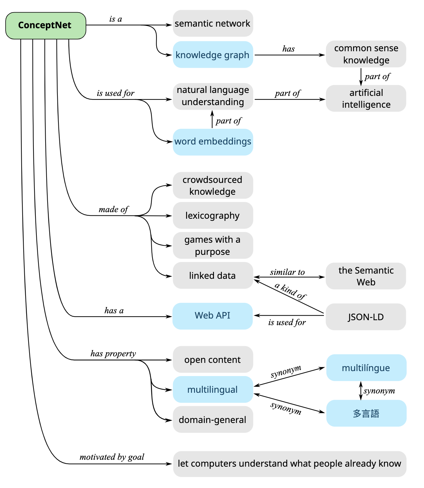
></details> 

<hr class="thin" />

{: .fs-4 .fw-800 .text-blue-100}
**📜 *[ATOMIC]* Atomic: An atlas of machine commonsense for if-then reasoning**. <br> ✍ Sap, M., Le Bras, R., Allaway, E., Bhagavatula, C., Lourie, N., Rashkin, H., Roof, B., Smith, N.A. and Choi, Y. *(AAAI 2019)*
 
<span class="fs-2">
   [Paper](https://arxiv.org/abs/1811.00146){: .btn .btn-blue .mr-1 target="_blank" } 
   [Data](https://homes.cs.washington.edu/~msap/atomic/){: target="_blank" .btn .btn-green .mr-1 } 
   [Explore](https://mosaickg.apps.allenai.org/kg_atomic){: target="_blank" .btn .btn-purple .mr-1 } 
</span> 


> - **Tags:** 
- **Size:** Around 877k textual descriptions of inferential knowledge.
- **Creation:** 
><details markdown="block">
>  <summary>Illustrative Example</summary>
>  {: .fs-3 .text-delta .text-red-100}
  ```
   Event: "PersonX uses PersonX's ___ to obtain"
      oEffect: []
      oReact: ['annoyed', 'angry', 'worried']
      oWant: []
      prefix: ['uses', 'obtain']
      split: 'trn'
      xAttr: []
      xEffect: []
      xIntent: ['to have an advantage', 'to fulfill a desire', 'to get out of trouble']
      xNeed: []
      xReact: ['pleased', 'smug', 'excited']
      xWant: []
  ``` 
  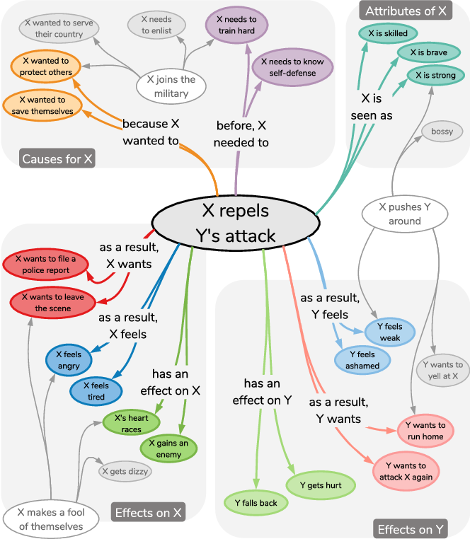
></details> 

<hr class="thin" />

{: .fs-4 .fw-800 .text-blue-100}
**📜 *[ATOMIC2020]* Comet-atomic 2020: On symbolic and neural commonsense knowledge graphs**. <br> ✍ Hwang, J. D., Bhagavatula, C., Bras, R. L., Da, J., Sakaguchi, K., Bosselut, A., & Choi, Y. *(arXiv 2020)*
 
<span class="fs-2">
   [Paper](https://arxiv.org/pdf/2010.05953){: .btn .btn-blue .mr-1 target="_blank" } 
   [Data](https://allenai.org/data/atomic-2020){: target="_blank" .btn .btn-green .mr-1 } 
</span> 


> - **Tags:** 
- **Size:** Around 1.33M everyday inferential knowledge tuples about entities and events.
- **Creation:** 
><details markdown="block">
>  <summary>Illustrative Example</summary>
>  {: .fs-3 .text-delta .text-red-100}
   
></details> 

<hr class="thin" />

{: .fs-4 .fw-800 .text-blue-100}
**📜 *[GLUCOSE]* Glucose: Generalized and contextualized story explanations**. <br> ✍ Mostafazadeh, N., Kalyanpur, A., Moon, L., Buchanan, D., Berkowitz, L., Biran, O., & Chu-Carroll, J. *(EMNLP 2020)*
 
<span class="fs-2">
   [Paper](https://arxiv.org/abs/2009.07758){: .btn .btn-blue .mr-1 target="_blank" } 
   [Data](https://github.com/ElementalCognition/glucose/){: target="_blank" .btn .btn-green .mr-1 } 
</span> 

> - **Tags:** 
- **Size:** More than 670K (335K pair) of GLUCOSE annotations.
- **Creation:** 
><details markdown="block">
>  <summary>Illustrative Example</summary>
>  {: .fs-3 .text-delta .text-red-100}
>   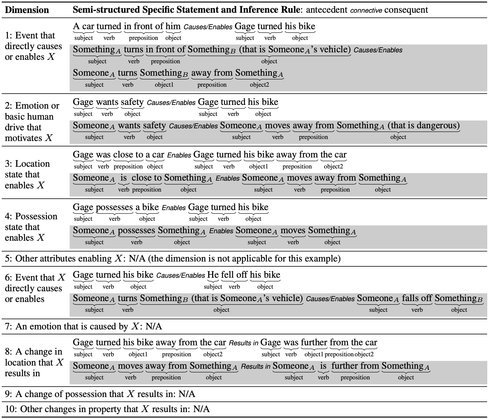
>   <p>Entries in the GLUCOSE dataset that explain the Gage story around the sentence <em>X= Gage turned his
bike sharply</em>.</p>
></details> 

<hr class="thin" />

{: .fs-4 .fw-800 .text-blue-100}
**📜 *[WebChild]* Webchild 2.0: Fine-grained commonsense knowledge distillation**. <br> ✍ Tandon, N., De Melo, G., & Weikum, G. *(ACL 2017)*
 
<span class="fs-2">
   [Paper](https://www.aclweb.org/anthology/P17-4020.pdf){: .btn .btn-blue .mr-1 target="_blank" } 
   [Data](https://www.mpi-inf.mpg.de/departments/databases-and-information-systems/research/yago-naga/commonsense/webchild){: target="_blank" .btn .btn-green .mr-1 } 
   [Explore](https://gate.d5.mpi-inf.mpg.de/webchild/){: target="_blank" .btn .btn-purple .mr-1 } 
</span> 

> - **Tags:** 
- **Size:** 
- **Creation:** 
><details markdown="block">
>  <summary>Illustrative Example</summary>
>  {: .fs-3 .text-delta .text-red-100}
   ```
   #word: animal
   sense-number: 1
   WordNet-synsetid: 100015388
   Definition (WordNet gloss): a living organism characterized by voluntary movement
   ```
>   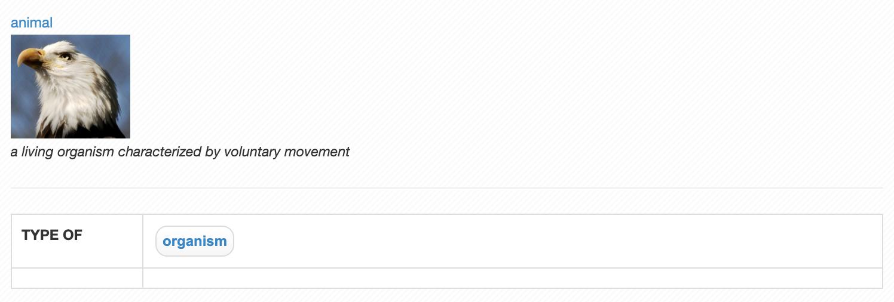
> <p>WebChild 2.0 browser results for <em>animal</em>.</p>
></details> 

<hr class="thin" />

{: .fs-4 .fw-800 .text-blue-100}
**📜 *[QuasimodoKB]* Commonsense properties from query logs and question answering forums**. <br> ✍ Romero, J., Razniewski, S., Pal, K., Z. Pan, J., Sakhadeo, A., & Weikum, G. *(CIKM 2019)*
 
<span class="fs-2">
   [Paper](https://arxiv.org/abs/1905.10989){: .btn .btn-blue .mr-1 target="_blank" } 
   [Data](https://www.mpi-inf.mpg.de/departments/databases-and-information-systems/research/yago-naga/commonsense/quasimodo/){: target="_blank" .btn .btn-green .mr-1 } 
   [Explore](https://quasimodo.r2.enst.fr/){: target="_blank" .btn .btn-purple .mr-1 } 
</span> 

> - **Tags:** 
- **Size:** 
- **Creation:** 
><details markdown="block">
>  <summary>Illustrative Example</summary>
>  {: .fs-3 .text-delta .text-red-100}
>   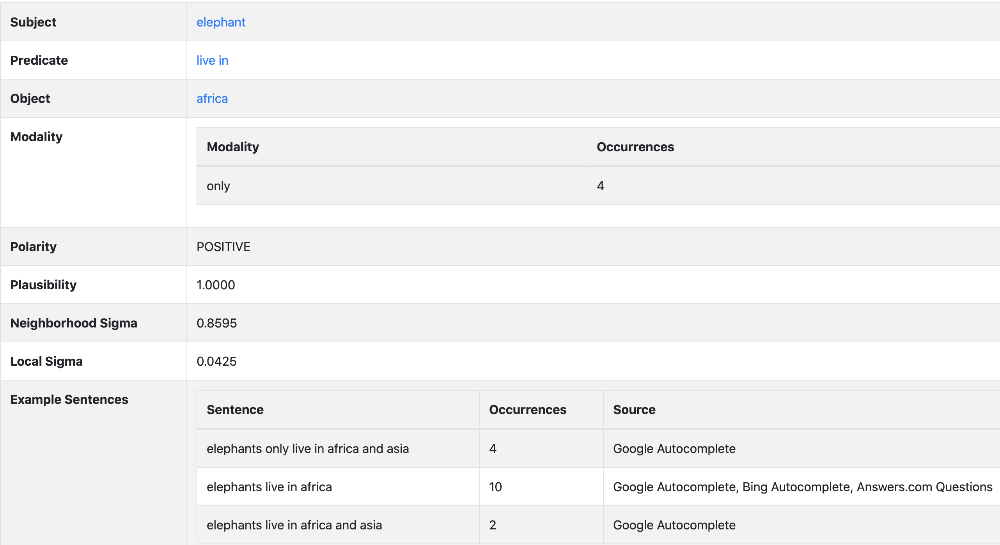
>   <p>Quasimodo browser results for <em>eggplant</em>.</p>
></details> 

<hr class="thin" />

{: .fs-4 .fw-800 .text-blue-100}
**📜 *[ASCENT]* Advanced Semantics for Commonsense Knowledge Extraction**. <br> ✍ Nguyen, T. P., Razniewski, S., & Weikum, G.  *(arXiv 2020)*
 
<span class="fs-2">
   [Paper](https://arxiv.org/pdf/2011.00905.pdf){: .btn .btn-blue .mr-1 target="_blank" } 
   [Data](https://ascent.mpi-inf.mpg.de/download){: target="_blank" .btn .btn-green .mr-1 } 
   [Explore](https://ascent.mpi-inf.mpg.de/browse){: target="_blank" .btn .btn-purple .mr-1 } 
</span> 

> - **Tags:** 
- **Size:** 
- **Creation:** 
><details markdown="block">
>  <summary>Illustrative Example</summary>
>  {: .fs-3 .text-delta .text-red-100}
> 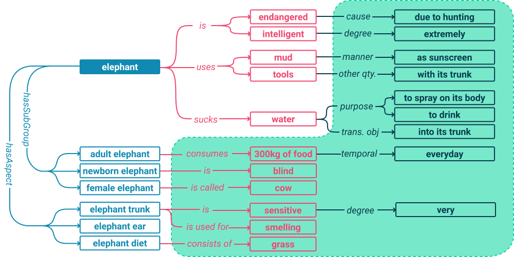
> <p>Example of Ascent’s knowledge for the concept <em>elephant</em>.</p>
></details> 

<hr class="thin" />

{: .fs-4 .fw-800 .text-blue-100}
**📜 *[SenticNet]* SenticNet 5: Discovering conceptual primitives for sentiment analysis by means of context embeddings**. <br> ✍ Cambria, E., Poria, S., Hazarika, D., & Kwok, K. *(AAAI 2018)*
 
<span class="fs-2">
   [Paper](https://ojs.aaai.org/index.php/AAAI/article/view/11559/11418){: .btn .btn-blue .mr-1 target="_blank" } 
   [Data](https://sentic.net/downloads/){: target="_blank" .btn .btn-green .mr-1 } 
   [Explore](https://sentic.net/demos/){: target="_blank" .btn .btn-purple .mr-1 } 
</span> 

> - **Tags:** 
- **Size:** 
- **Creation:** 
><details markdown="block">
>  <summary>Illustrative Example</summary>
>  {: .fs-3 .text-delta .text-red-100}
   ```
   concept_name: intact
   introspection_value: 0.716,  temper_value: -0.62,  attitude_value: 0,  sensitivity_value: 0.896
   primary_mood: joy,  secondary_mood: eagerness,  polarity_label: positive,  polarity_value: 0.328
   semantics1: constitutional,  semantics2: intrinsic,  semantics3: intimate,  semantics4: inner,  semantics5: inbuilt
   ```
>   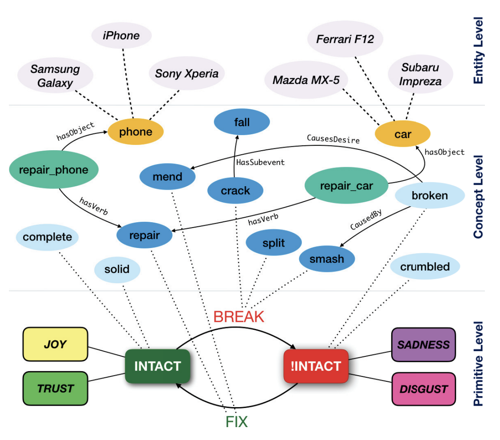
>   <p>A sketch of SenticNet 5’s graph showing part of the semantic network for the primitive <em>INTACT</em>.</p>
></details> 

<hr class="thin" />

{: .fs-4 .fw-800 .text-blue-100}
**📜 *[HasPartKB]* Do dogs have whiskers? a new knowledge base of haspart relations**. <br> ✍ Bhakthavatsalam, S., Richardson, K., Tandon, N., & Clark, P. *(arXiv 2020)*
 
<span class="fs-2">
   [Paper](https://arxiv.org/abs/2006.07510){: .btn .btn-blue .mr-1 target="_blank" } 
   [Data](https://drive.google.com/drive/folders/1NzjXX46NnpxtgxBrkBWFiUbsXAMdd-lB){: target="_blank" .btn .btn-green .mr-1 } 
</span> 

> - **Tags:** 
- **Size:** 
- **Creation:** 
><details markdown="block">
>  <summary>Illustrative Example</summary>
>  {: .fs-3 .text-delta .text-red-100}
   ```
   arg1: snowdrop,  metadata: wikipedia_primary_page -- Galanthus
   arg2: carpel,  metadata: synset -- wn.carpel.n.01
   average_score: 0.9990746974945068
   matches: some carpels are part of snowdrops.
   ```
></details> 
<hr class="thin" />

{: .fs-4 .fw-800 .text-blue-100}
**📜 *[ASER]* ASER: A Large-scale Eventuality Knowledge Graph**. <br> ✍ Hongming Zhang, Xin Liu, Haojie Pan, Yangqiu Song, Cane Wing-Ki Leung. *(WWW 2020)*
 
<span class="fs-2">
   [Paper](https://arxiv.org/abs/1905.00270){: .btn .btn-blue .mr-1 target="_blank" } 
   [Data](https://hkustconnect-my.sharepoint.com/personal/xliucr_connect_ust_hk/_layouts/15/onedrive.aspx?id=%2Fpersonal%2Fxliucr%5Fconnect%5Fust%5Fhk%2FDocuments%2FDocuments%2FHKUST%2FResearch%2FASER%2Fv1%2E0&originalPath=aHR0cHM6Ly9oa3VzdGNvbm5lY3QtbXkuc2hhcmVwb2ludC5jb20vOmY6L2cvcGVyc29uYWwveGxpdWNyX2Nvbm5lY3RfdXN0X2hrL0VvTkMtaEZORXNOTHJadmc3M2kxNGU4Qk1BVURSMjBUbXVMWTBXLTZ0RmhLRVE%5FcnRpbWU9ZjZBN1l0TUcyVWc){: target="_blank" .btn .btn-green .mr-1 }
   [Github](https://github.com/HKUST-KnowComp/ASER/tree/release/1.0){: target="_blank" .btn .btn-white .mr-1 } 
</span> 

> - **Tags:** 
- **Size:** 
- **Creation:** 
><details markdown="block">
>  <summary>Illustrative Example</summary>
>  {: .fs-3 .text-delta .text-red-100}
>   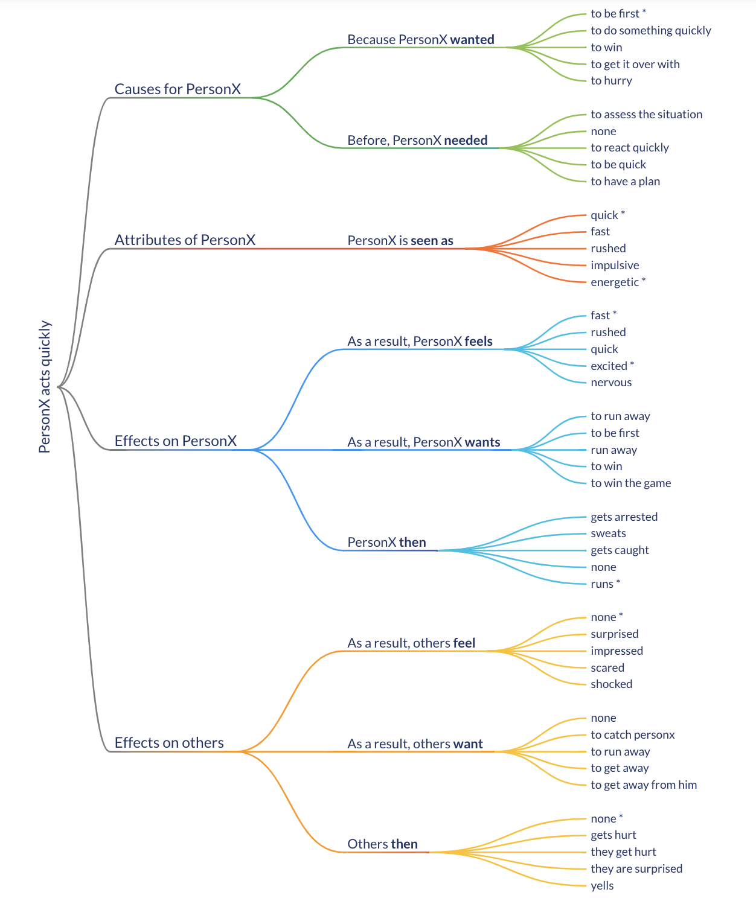
>  <p>An example image of <em>PersonX acts quickly</em> from the COMET dataset.</p>
></details> 


<hr class="thin" />

{: .fs-4 .fw-800 .text-blue-100}
**📜 *[CYC]* CYC: A large-scale investment in knowledge infrastructure**. <br> ✍ Lenat, D. *(Communications of the ACM 1995)*
 
<span class="fs-2">
   [Paper](https://dl.acm.org/doi/pdf/10.1145/219717.219745?casa_token=VVv0CwYIZYcAAAAA:uSuKzsL4JiQSqG11QmgUv7yKDffjkDAohFp05tD2gkVr9LBvJJo33VNWIQJbPSrgRTAUjqyzKsOoTQ){: .btn .btn-blue .mr-1 target="_blank" } 
   [Data](https://github.com/asanchez75/opencyc){: target="_blank" .btn .btn-green .mr-1 } 
</span> 

Note that the data link is from OpenCyc, which is a subset of Cyc. The entire Cyc is not publicly available. 

> - **Tags:** 
- **Size:** 
- **Creation:** 
><details markdown="block">
>  <summary>Illustrative Example</summary>
>  {: .fs-3 .text-delta .text-red-100}
   Sample assertions of everyday life and objects spanned by the domain of <strong>CYC</strong>:
   ```
   • You have to be awake to eat.
   • You can usually see people’s noses, but not their hearts.
   • Given two professions, either one is a specialization of the other or else they are likely to be independent of one another.
   • You cannot remember events that have not happened yet.
   • If you cut a lump of peanut butter in half, each half is also a lump of peanut butter; but if you cut a table in half, neither half is a table.
   ```
></details> 

<hr class="thin" />

{: .fs-4 .fw-800 .text-blue-100}
**📜 *[COMET]* Comet: Commonsense transformers for automatic knowledge graph construction**. <br> ✍ Bosselut, A., Rashkin, H., Sap, M., Malaviya, C., Celikyilmaz, A., & Choi, Y.  *(ACL 2019)*
 
<span class="fs-2">
   [Paper](https://www.aclweb.org/anthology/P19-1470.pdf){: .btn .btn-blue .mr-1 target="_blank" } 
   [Explore](https://mosaickg.apps.allenai.org/comet_atomic){: target="_blank" .btn .btn-purple .mr-1 } 
   [Github](https://github.com/atcbosselut/comet-commonsense){: target="_blank" .btn .btn-white .mr-1 }
</span> 

> - **Tags:** 
- **Size:** 
- **Creation:** 
><details markdown="block">
>  <summary>Illustrative Example</summary>
>  {: .fs-3 .text-delta .text-red-100}
>   
>  <p>An example image of <em>PersonX acts quickly</em> from the COMET dataset.</p>
></details> 

<hr class="thin" />

{: .fs-4 .fw-800 .text-blue-100}
**📜 *[GenericsKB]* Genericskb: A knowledge base of generic statements**. <br> ✍ Bhakthavatsalam, S., Anastasiades, C., & Clark, P. *(arXiv 2020)*
 
<span class="fs-2">
   [Paper](https://arxiv.org/pdf/2005.00660.pdf){: .btn .btn-blue .mr-1 target="_blank" } 
   [Data](https://drive.google.com/drive/folders/1vqfVXhJXJWuiiXbUa4rZjOgQoJvwZUoT){: target="_blank" .btn .btn-green .mr-1 } 
</span> 

> - **Tags:** 
- **Size:** 
- **Creation:** 
><details markdown="block">
>  <summary>Illustrative Example</summary>
>  {: .fs-3 .text-delta .text-red-100}
>   Example generics about <em>tree</em> in GENERICSKB:
   ```
   1. Trees are perennial plants that have long woody trunks.
   2. Trees are woody plants which continue growing until they die.
   3. Most trees add one new ring for each year of growth.
   4. Trees produce oxygen by absorbing carbon dioxide from the air.
   5. Trees are large, generally single-stemmed, woody plants.
   6. Trees live in cavities or hollows.
   7. Trees grow using photosynthesis, absorbing carbon dioxide and releasing oxygen.
   ```
>   An example entry, including metadata
   ```
   Term: tree
   Sent: Most trees add one new ring for each year of growth.
   Quantifier: Most
   Score: 0.35
   Before: ...Notice how the extractor holds the core as it is removed from inside the hollow center of the bit. Tree cores are extracted with an increment borer.
   After: The width of each annual ring may be a reflection of forest stand dynamics. Dendrochronology, the study of annual growth rings, has become prominent in ecology...
   ```
></details> 


---

## Common Knowledge
<br>

{: .fs-4 .fw-800 .text-blue-100}
**📜 *[Wikidata]* Wikidata: a free collaborative knowledgebase**. <br> ✍ Vrandečić, D., & Krötzsch, M. *(ACM 2014)*
 
<span class="fs-2">
   [Paper](https://dl.acm.org/doi/fullHtml/10.1145/2629489){: .btn .btn-blue .mr-1 target="_blank" } 
   [Data](https://www.wikidata.org/wiki/Wikidata:Database_download){: target="_blank" .btn .btn-green .mr-1 } 
   [Explore](https://www.wikidata.org/wiki/Wikidata:Main_Page){: target="_blank" .btn .btn-purple .mr-1 } 
</span> 

> - **Tags:** 
- **Size:** 
- **Creation:** 
><details markdown="block">
>  <summary>Illustrative Example</summary>
>  {: .fs-3 .text-delta .text-red-100}
>   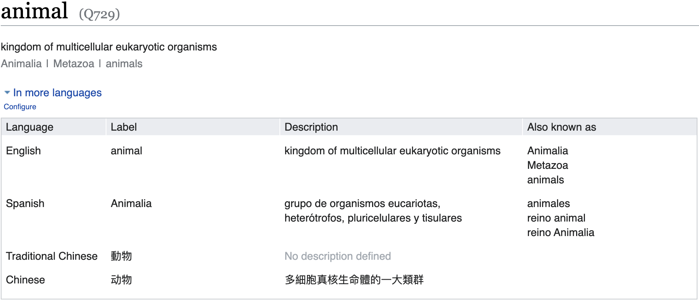
>   <p>Wikidata browser results for <em>animal</em>.</p>
></details> 

<hr class="thin" />

{: .fs-4 .fw-800 .text-blue-100}
**📜 *[Wikidata-CS]* Commonsense knowledge in Wikidata**. <br> ✍ Ilievski, F., Szekely, P., & Schwabe, D. *(ISWC Wikidata workshop 2020)*
 
<span class="fs-2">
   [Paper](https://arxiv.org/pdf/2008.08114){: .btn .btn-blue .mr-1 target="_blank" } 
   [Data](https://zenodo.org/record/3983030#.YGdfk0hKimk){: target="_blank" .btn .btn-green .mr-1 } 
</span> 

> - **Tags:** 
- **Size:** 
- **Creation:** 
><details markdown="block">
>  <summary>Illustrative Example</summary>
>  {: .fs-3 .text-delta .text-red-100}
   ```
   node1: Q1203797,  label: bicycle
   relation: /r/IsA
   node2: Q2207288,  label: messenger
   label relation: instance of
   ```
></details> 

<hr class="thin" />

{: .fs-4 .fw-800 .text-blue-100}
**📜 *[YAGO]* Yago 4: A reason-able knowledge base**. <br> ✍ Tanon, T. P., Weikum, G., & Suchanek, F. *(ESWC 2020)*
 
<span class="fs-2">
   [Paper](https://link.springer.com/chapter/10.1007/978-3-030-49461-2_34){: .btn .btn-blue .mr-1 target="_blank" } 
   [Data](https://yago-knowledge.org/downloads/yago-4){: target="_blank" .btn .btn-green .mr-1 } 
   [Explore](https://yago-knowledge.org/graph/Elvis_Presley){: target="_blank" .btn .btn-purple .mr-1 } 
</span> 

> - **Tags:** 
- **Size:** 
- **Creation:** 
><details markdown="block">
>  <summary>Illustrative Example</summary>
>  {: .fs-3 .text-delta .text-red-100}
>   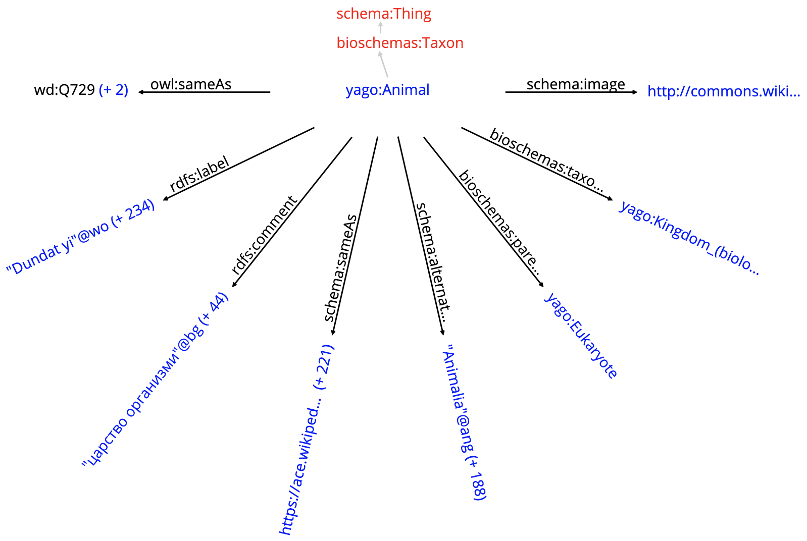
>   <p>YAGO browser results for <em>animal</em>.</p>
></details> 

<hr class="thin" />

{: .fs-4 .fw-800 .text-blue-100}
**📜 *[SUMO]* Towards a standard upper ontology**. <br> ✍ Niles, I., & Pease, A. *(ICFOIS 2001)*
 
<span class="fs-2">
   [Paper](https://dl.acm.org/doi/pdf/10.1145/505168.505170?casa_token=EAVIrkqcN6MAAAAA:hE2ywSjdknydIm-guusn-FJHHuLKTk0wvKvj773PzQzfMLFAHJ83L2MbfRJMGgN_D1huaPCzP6of_A){: .btn .btn-blue .mr-1 target="_blank" } 
   [Data](https://github.com/ontologyportal/sumo){: target="_blank" .btn .btn-green .mr-1 } 
   [Explore](https://sigma.ontologyportal.org:8443/sigma/Browse.jsp?kb=SUMO){: target="_blank" .btn .btn-purple .mr-1 } 
</span> 

> - **Tags:** 
- **Size:** 
- **Creation:** 
><details markdown="block">
>  <summary>Illustrative Example</summary>
>  {: .fs-3 .text-delta .text-red-100}
>   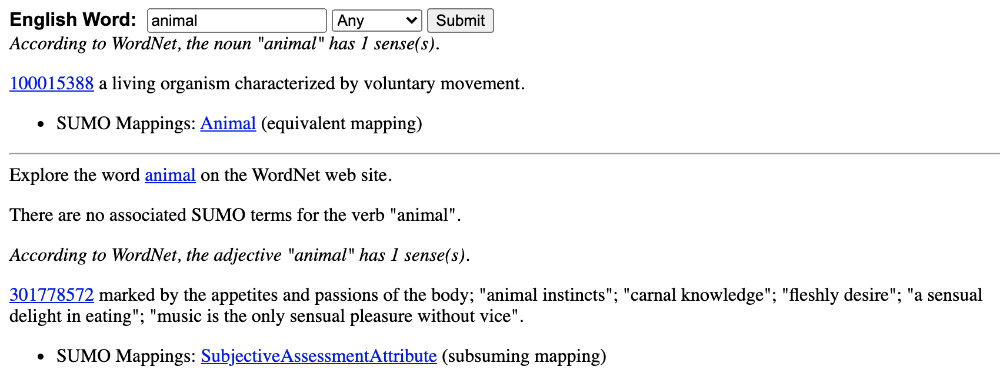
>   <p>SUMO browser results for <em>animal</em>.</p>
></details> 

<hr class="thin" />

{: .fs-4 .fw-800 .text-blue-100}
**📜 *[DOLCE]* Sweetening ontologies with DOLCE**. <br> ✍ Gangemi, A., Guarino, N., Masolo, C., Oltramari, A., & Schneider, L. *(ICKEKM 2002)*
 
<span class="fs-2">
   [Paper](https://pub.uni-bielefeld.de/download/2497408/2524762/SWIntO.pdf){: .btn .btn-blue .mr-1 target="_blank" } 
   [Data](http://www.loa.istc.cnr.it/dolce/overview.html){: target="_blank" .btn .btn-green .mr-1 } 
</span> 

> - **Tags:** 
- **Size:** 
- **Creation:** 
><details markdown="block">
>  <summary>Illustrative Example</summary>
>  {: .fs-3 .text-delta .text-red-100} 
>   <p>Taxonomy of <strong>DOLCE</strong> basic categories:</p>
>   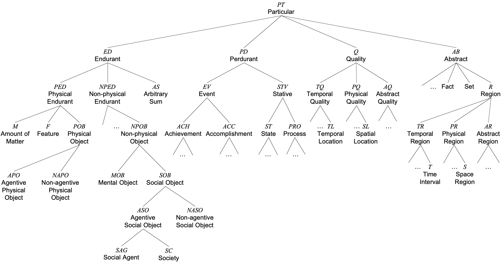
>   <p>Examples of <em>leaf</em> basic categories:</p>
>   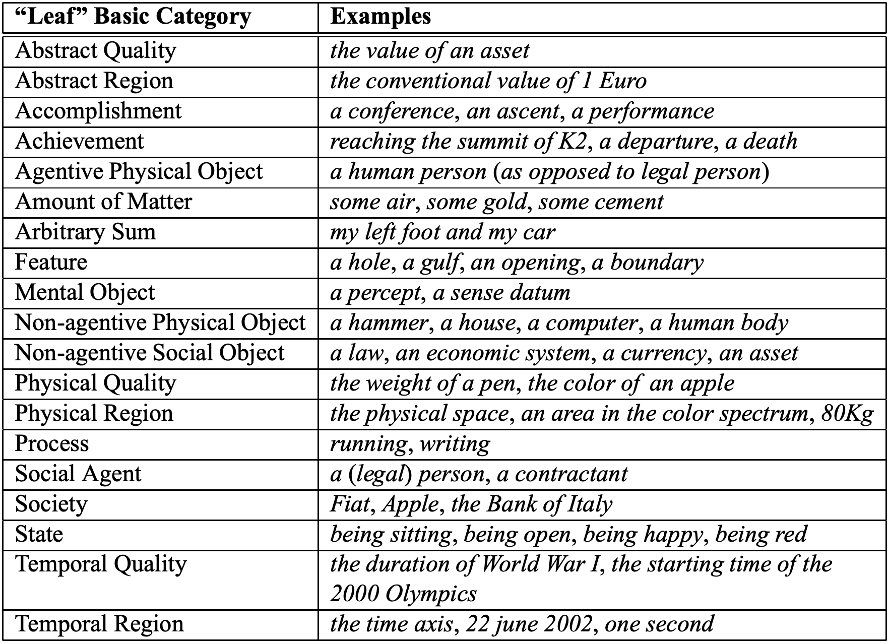
></details> 

---

## Lexical Knowledge
<br>


{: .fs-4 .fw-800 .text-blue-100}
**📜 *[WordNet]* WordNet: a lexical database for English**. <br> ✍ Miller, G. *(ACM 1995)*
 
<span class="fs-2">
   [Paper](https://dl.acm.org/doi/pdf/10.1145/219717.219748?casa_token=LyuOSovkFX4AAAAA:B0BfseVMzRQ2zSVdnWLCaIh57cy8Y8RDLf9OwxwMcFSEbpxK7V-9mR-X6jkipUxsw8h1OVSfo8qTFQ){: .btn .btn-blue .mr-1 target="_blank" } 
   [Data](https://wordnet.princeton.edu/download){: target="_blank" .btn .btn-green .mr-1 } 
   [Explore](http://wordnetweb.princeton.edu/perl/webwn){: target="_blank" .btn .btn-purple .mr-1 } 
</span> 

> - **Tags:** 
- **Size:** 
- **Creation:** 
><details markdown="block">
>  <summary>Illustrative Example</summary>
>  {: .fs-3 .text-delta .text-red-100}
>   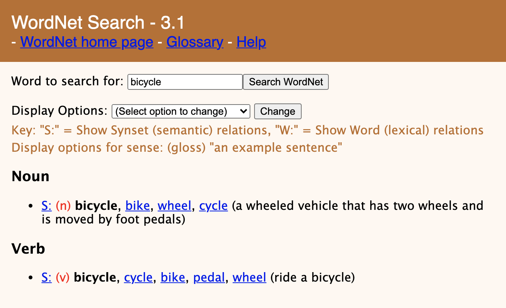
>   <p>WordNet browser results for <em>bicycle</em>.</p>
></details> 

<hr class="thin" />

{: .fs-4 .fw-800 .text-blue-100}
**📜 *[FrameNet]* The berkeley framenet project**. <br> ✍ Baker, C. F., Fillmore, C. J., & Lowe, J. B.  *(ACL 1998)*
 
<span class="fs-2">
   [Paper](https://www.aclweb.org/anthology/P98-1013.pdf){: .btn .btn-blue .mr-1 target="_blank" } 
   [Data](https://framenet.icsi.berkeley.edu/fndrupal/framenet_request_data){: target="_blank" .btn .btn-green .mr-1 } 
   [Explore](https://framenet.icsi.berkeley.edu/fndrupal/frameIndex){: target="_blank" .btn .btn-purple .mr-1 } 
</span> 


> - **Tags:** 
- **Size:** 
- **Creation:** 
><details markdown="block">
>  <summary>Illustrative Example</summary>
>  {: .fs-3 .text-delta .text-red-100}
>   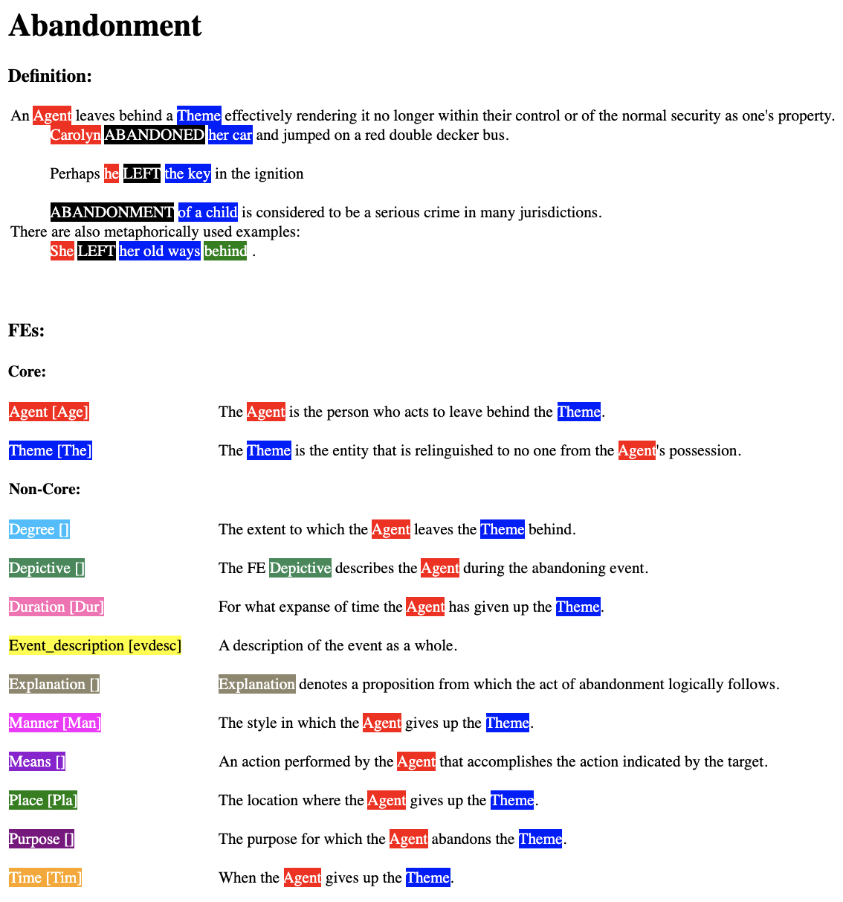 
>   <p>FrameNet browser results for <em>abandonment</em>.</p>
></details> 

<hr class="thin" />

{: .fs-4 .fw-800 .text-blue-100}
**📜 *[MetaNet]* MetaNet: Deep semantic automatic metaphor analysis**. <br> ✍ Dodge, E. K., Hong, J., & Stickles, E. *(Metaphor in NLP workshop 2015)*
 
<span class="fs-2">
   [Paper](https://www.aclweb.org/anthology/W15-1405.pdf){: .btn .btn-blue .mr-1 target="_blank" } 
   [Explore](https://metaphor.icsi.berkeley.edu/pub/en/index.php/Category:Metaphor){: target="_blank" .btn .btn-purple .mr-1 } 
</span> 


> - **Tags:** 
- **Size:** 
- **Creation:** 
><details markdown="block">
>  <summary>Illustrative Example</summary>
>  {: .fs-3 .text-delta .text-red-100}
>   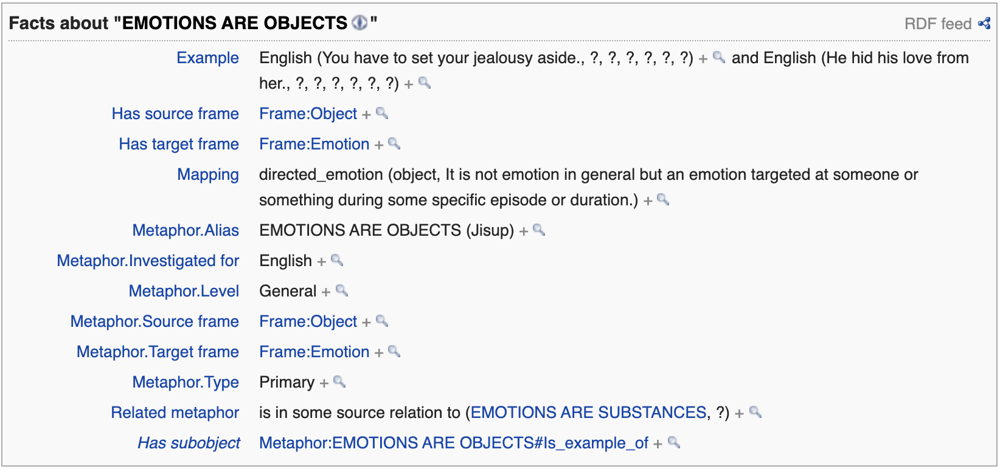 
>   <p>MetaNet browser results for <em>EMOTIONS AND OBJECTS</em>.</p>
></details> 

<hr class="thin" />

{: .fs-4 .fw-800 .text-blue-100}
**📜 *[VerbNet]* VerbNet: A broad-coverage, comprehensive verb lexicon**. <br> ✍ Schuler, K. K. *(Dissertation 2005)*
 
<span class="fs-2">
   [Paper](https://www.proquest.com/docview/305449413){: .btn .btn-blue .mr-1 target="_blank" } 
   [Data](https://verbs.colorado.edu/verbnet/){: target="_blank" .btn .btn-green .mr-1 } 
   [Explore](https://verbs.colorado.edu/verb-index/vn3.3/){: target="_blank" .btn .btn-purple .mr-1 } 
</span> 


> - **Tags:** 
- **Size:** 
- **Creation:** 
><details markdown="block">
>  <summary>Illustrative Example</summary>
>  {: .fs-3 .text-delta .text-red-100}
>   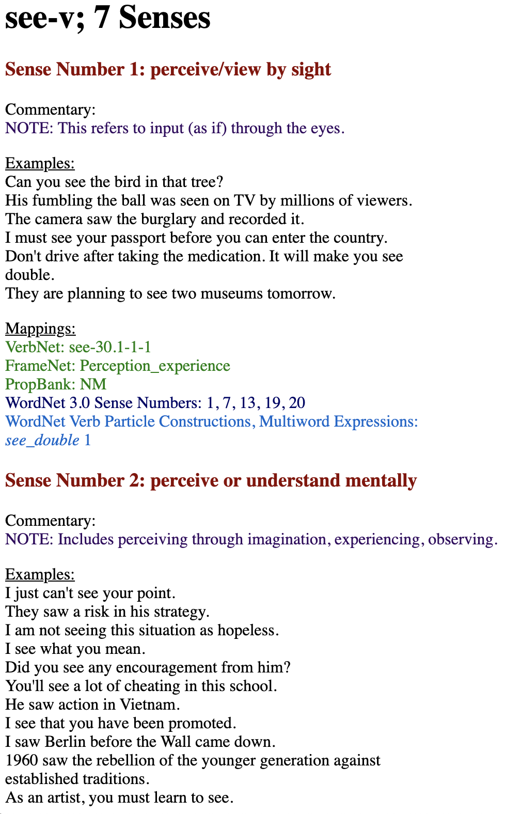
>   <p>VerbNet browser results for <em>see</em>.</p>
></details> 

---

## Visual Knowledge
<br>

{: .fs-4 .fw-800 .text-blue-100}
**📜 *[Visual Genome]* Visual genome: Connecting language and vision using crowdsourced dense image annotations**. <br> ✍ Krishna, R., Zhu, Y., Groth, O., Johnson, J., Hata, K., Kravitz, J., Chen, S., Kalantidis, Y., Li, L.J., Shamma, D.A., Bernstein, M.S. *(IJCV 2017)*
 
<span class="fs-2">
   [Paper](https://link.springer.com/content/pdf/10.1007/s11263-016-0981-7.pdf){: .btn .btn-blue .mr-1 target="_blank" } 
   [Data](http://visualgenome.org/api/v0/api_home.html){: target="_blank" .btn .btn-green .mr-1 } 
   [Explore](http://visualgenome.org/VGViz/explore){: target="_blank" .btn .btn-purple .mr-1 } 
</span> 

> - **Tags:**
- **Size:** 12,102 in total --- train (9,741), dev (1,221), test (1,140).
- **Creation:** 
><details markdown="block">
>  <summary>Illustrative Example</summary>
>  {: .fs-3 .text-delta .text-red-100}
>  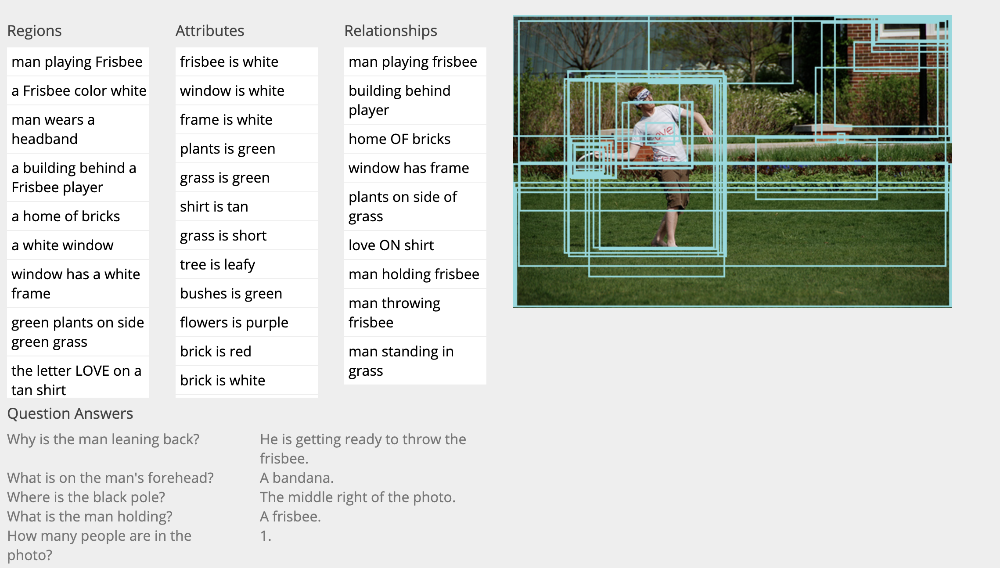
>  <p>An example image of <em>throwing frisbee</em> from the Visual Genome dataset.</p>
></details> 

<hr class="thin" />

{: .fs-4 .fw-800 .text-blue-100}
**📜 *[Flickr30k]* Flickr30k entities: Collecting region-to-phrase correspondences for richer image-to-sentence models**. <br> ✍ Plummer, B. A., Wang, L., Cervantes, C. M., Caicedo, J. C., Hockenmaier, J., & Lazebnik, S. *(ICCV 2015)*
 
<span class="fs-2">
   [Paper](https://openaccess.thecvf.com/content_iccv_2015/papers/Plummer_Flickr30k_Entities_Collecting_ICCV_2015_paper.pdf){: .btn .btn-blue .mr-1 target="_blank" }
   [Data](http://bryanplummer.com/Flickr30kEntities/){: target="_blank" .btn .btn-green .mr-1 } 
</span> 


> - **Tags:** 
- **Size:** 
- **Creation:** 
><details markdown="block">
>  <summary>Illustrative Example</summary>
>  {: .fs-3 .text-delta .text-red-100}
>   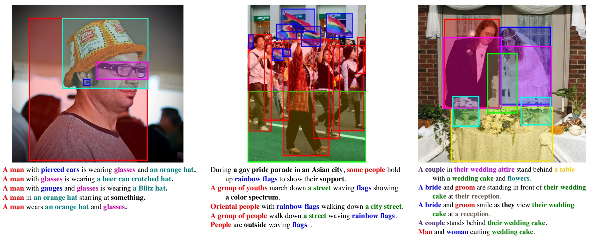
>   <p>Example images from the Flickr30k Entities dataset.</p>
></details> 


---


## Consolidation & Surveys
<br>

{: .fs-4 .fw-800 .text-blue-100}
**📜 *[CSKG]* CSKG: The CommonSense Knowledge Graph**. <br> ✍ Ilievski, F., Szekely, P., Zhang, B. *(ESWC 2021)*
 
<span class="fs-2">
   [Paper](https://arxiv.org/pdf/2012.11490.pdf){: .btn .btn-blue .mr-1 target="_blank" } 
   [Data](https://zenodo.org/record/4331372#.YGdj2EhKimk){: target="_blank" .btn .btn-green .mr-1 } 
</span> 


> - **Tags:** 
- **Size:** 
- **Creation:** 
><details markdown="block">
>  <summary>Illustrative Example</summary>
>  {: .fs-3 .text-delta .text-red-100}
   ```
   node1: person
   node2: architect
   label relation: /r/IsA
   sentence: architect is a person
   ```
>   An example graph from the CSKG dataset:
>   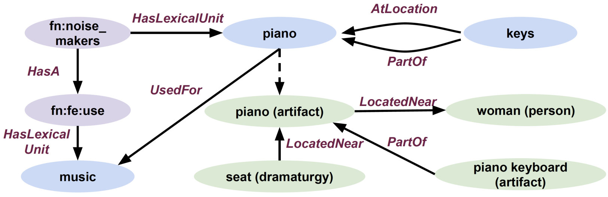
></details> 

<hr class="thin" />

{: .fs-4 .fw-800 .text-blue-100}
**📜 Dimensions of commonsense knowledge**. <br> ✍ Ilievski, F., Oltramari, A., Ma, K., Zhang, B., McGuinness, D. L., Szekely, P. *(arXiv 2021)*
 
<span class="fs-2">
   [Paper](https://arxiv.org/pdf/2101.04640){: .btn .btn-blue .mr-1 target="_blank" } 
   [Data](https://drive.google.com/drive/u/1/folders/16347KHSloJJZIbgC9V5gH7_pRx0CzjPQ){: target="_blank" .btn .btn-green .mr-1 } 
</span> 


> - **Tags:** 
- **Size:** 
- **Creation:** 
><details markdown="block">
>  <summary>Illustrative Example</summary>
>  {: .fs-3 .text-delta .text-red-100}
   Examples for <em>food</em> for each of the 13 dimensions:
   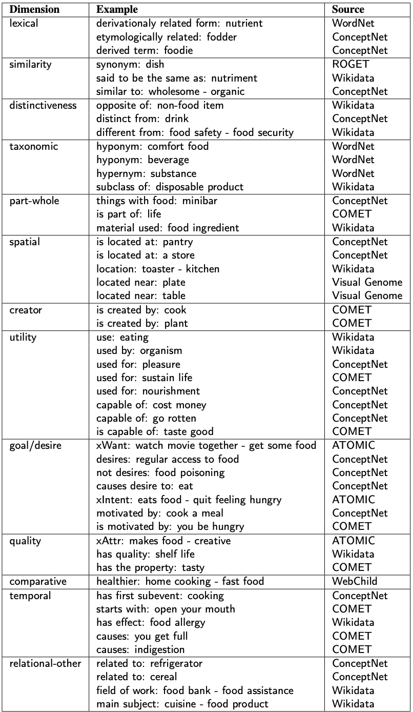
></details> 

<hr class="thin" />

{: .fs-4 .fw-800 .text-blue-100}
**📜 *[NextKB]* Analogy and relational representations in the companion cognitive architecture**. <br> ✍ Forbus, K. D., & Hinrich, T. *(AI Magazine 2017)*
 
<span class="fs-2">
   [Paper](https://ojs.aaai.org/index.php/aimagazine/article/view/2743/2672){: .btn .btn-blue .mr-1 target="_blank" } 
   [Data](https://www.qrg.northwestern.edu/nextkb/index.html){: target="_blank" .btn .btn-green .mr-1 } 
</span> 
